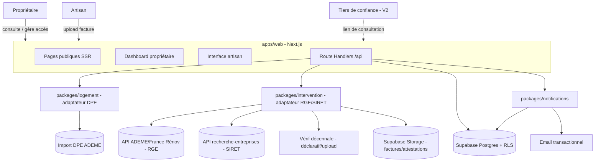

# INSTALL.md - `foya`

Technical vision and installation guide.

## Vision

Un carnet de santé numérique du logement, alimenté par les artisans, pour la tranquillité du propriétaire et la valorisation du bien à la revente.

Foya numérise le Carnet d'Information du Logement (CIL) obligatoire depuis 2023, mais le vend comme un carnet de santé de la maison plutôt qu'une contrainte de conformité. L'adoption est tirée par les artisans (upload facture → vérification RGE/décennale → fiche logement mise à jour automatiquement), pas par le propriétaire, qui découvre passivement sa fiche puis s'engage via des rappels d'entretien et un export "dossier de vente" au moment de la revente.

## Decisions

| Decision      | Choice                                          | Why                                                                                                                                                    |
| ------------- | ------------------------------------------------ | -------------------------------------------------------------------------------------------------------------------------------------------------- |
| Architecture  | Modular monolith                                 | Équipe solo/petite, MVP à 5 fonctionnalités, pas de temps réel — un monolith suffit, mais des frontières de modules dès le départ absorbent la croissance V2 (API tiers de confiance) sans réécriture. |
| Front-end     | Next.js 15 (App Router, SSR)                     | SEO nécessaire pour les pages publiques d'acquisition artisans/propriétaires ; équipe maîtrise TypeScript full-stack.                                 |
| Back-end      | Next.js Route Handlers (TypeScript)               | Même langage que le front, pas de besoin de performance exotique, évite un second runtime pour une équipe solo.                                       |
| Database      | Supabase Postgres (EU/Frankfurt)                  | Données fortement relationnelles (logement → intervention → artisan → attestations) + RGPD ; Frankfurt satisfait le RGPD (portée UE, pas nationale) pour un public B2C/artisans. |
| Auth          | Supabase Auth + Row-Level Security                | Le modèle d'accès par fiche logement (pas de multi-tenant classique) se mappe directement sur des policies RLS par ressource plutôt qu'un système de rôles custom. |
| Hosting       | Vercel Pro + Supabase Pro, région épinglée `fra1` | Budget bootstrap ; les tiers gratuits sont interdits d'usage commercial (Vercel) ou sans SLA/backup (Supabase) pour un pilote réel avec des artisans payants. |

## Stack summary

- **Front-end:** Next.js 15 (App Router), TypeScript, déployé sur Vercel Pro
- **Back-end:** Next.js Route Handlers (TypeScript), logique métier organisée en modules `packages/*`
- **Database:** Supabase Postgres (région EU `fra1`), Row-Level Security via fonctions `SECURITY DEFINER`
- **Auth:** Supabase Auth (email/mot de passe + magic link), sessions vérifiées dans les Route Handlers, jamais dans `middleware.ts`
- **Hosting:** Vercel Pro (app) + Supabase Pro (DB, Auth, Storage), région EU épinglée
- **Key integrations:** API ADEME/France Rénov (statut RGE), data.ademe.fr (DPE), vérification décennale (déclarative/upload — pas d'API publique existante), email transactionnel (V1), Enedis/GRDF et connecteurs logiciels artisans (V2)

## Architecture



Les modules `packages/*` (logement, intervention, notifications) sont indépendants et ne communiquent qu'à travers `packages/db` — aucun accès direct entre modules, ce qui garde la frontière d'accès (RLS/ACL) au niveau des données plutôt qu'au niveau du code métier. `intervention` et `logement` sont les deux seuls modules qui parlent aux APIs externes ADEME, chacun pour son propre domaine (`intervention` pour le statut RGE et le SIRET, `logement` pour l'import DPE) ; `intervention` reste seul à parler au stockage de fichiers.

**Écart constaté (audit 2026-07-31) :** `packages/logement` et `packages/intervention` ne sont en pratique que de fins adaptateurs pour ces APIs externes — tout le CRUD (logements, interventions, contacts, rappels, devis, etc.) vit directement dans `apps/web` via des appels `.from(...)` inline, pas dans ces packages. `packages/artisan` n'a jamais été créé ; les comptes/profils artisan vivent dans `apps/web/app/api/artisan/*` et `apps/web/app/(artisan)/*`. La frontière RLS/`SECURITY DEFINER` elle-même reste solide malgré cet écart — c'est la frontière de *code* qui a dérivé, pas la frontière de *données*. Deux chemins d'écriture coexistent délibérément dans `apps/web` : un Route Handler (`apps/web/app/api/**/route.ts`) pour toute mutation avec un effet de bord (appel externe, email, upload, RPC métier), et un appel client direct + RLS pour du CRUD simple sur une seule table (voir les composants `*Row.tsx`/`*Form.tsx` sous `app/(owner)/proprietaire/espace/**`). Choisissez le premier dès qu'une mutation fait plus qu'un `insert`/`update`/`delete` sur sa propre table.

## Folder structure

```
foya/
├── apps/
│   └── web/                          # Next.js 15 App Router
│       ├── app/
│       │   ├── (public)/             # pages SEO : landing, acquisition artisans
│       │   ├── (owner)/              # dashboard propriétaire (authentifié)
│       │   ├── (artisan)/            # interface artisan (authentifié)
│       │   ├── (agence)/             # consultation lecture seule agence (authentifié, invitation-only)
│       │   └── api/                  # Route Handlers (REST)
│       ├── middleware.ts             # refresh session uniquement, jamais d'ACL/PII
│       └── next.config.ts
├── packages/
│   ├── logement/                     # adaptateur import DPE (ADEME) — le CRUD logement vit dans apps/web
│   ├── intervention/                 # adaptateur vérif RGE (ADEME) + SIRET (recherche-entreprises)
│   ├── notifications/                # envoi d'email (Resend)
│   ├── db/                           # client Supabase, migrations, policies RLS
│   └── ui/                           # composants partagés
├── supabase/
│   ├── migrations/
│   └── policies/                     # fonctions SECURITY DEFINER (ACL par fiche)
├── docs/
│   └── cahier-des-charges-cil.md
├── aidd_docs/
│   └── INSTALL.md
├── CONTRIBUTING.md
├── package.json
└── pnpm-workspace.yaml
```

## Install steps

Manual install - the framework does not yet scaffold these automatically.

1. Créer un compte Supabase, un projet en région EU (`fra1` / Frankfurt), passer sur le plan Pro (le plan gratuit se met en pause après 7 jours d'inactivité et n'a pas de backup).
2. Créer un compte Vercel, passer sur le plan Pro (le plan Hobby interdit l'usage commercial par ses CGU).
3. Initialiser le monorepo (`pnpm init` + workspaces `apps/*` `packages/*`), scaffolder `apps/web` en Next.js 15 App Router + TypeScript.
4. Configurer `packages/db` : client Supabase, variables d'environnement (`SUPABASE_URL`, `SUPABASE_ANON_KEY`, `SUPABASE_SERVICE_ROLE_KEY`), migrations initiales pour les tables logement / intervention / artisan.
5. Écrire les policies RLS avec des fonctions `SECURITY DEFINER` pour le modèle d'accès par fiche logement (éviter les policies auto-référentielles naïves, cause connue de récursion en production).
6. Obtenir les accès aux APIs externes : API ADEME/France Rénov (statut RGE), data.ademe.fr (DPE) — la vérification décennale reste déclarative/upload en l'absence d'API publique.
7. Configurer l'envoi d'email transactionnel (rappels d'entretien, notification artisan → propriétaire).

## Audit summary

Results of the multi-agent audit run during action 03:

| Candidate                                  | Verdict | Notes                                                                                                          |
| ------------------------------------------- | ------- | ---------------------------------------------------------------------------------------------------------- |
| A — Monolith Next.js + Scaleway              | ⚠️      | 100% France, mais pas d'API décennale publique ; palier Postgres non-HA à 11€/mois, hausse tarifaire Scaleway prévue juin 2026. |
| B — Modular monolith Next.js + Supabase/Vercel (retenu) | ⚠️      | Frankfurt légalement suffisant pour le RGPD B2C ; budget réaliste ~40-45€/mois (pas 0-25€) ; RLS auto-référentielle à concevoir avec des fonctions `SECURITY DEFINER` pour éviter la récursion. |
| C — Modular monolith Next.js + OVH self-hosted (Coolify) | ⚠️      | Coût cash le plus bas mais MinIO en mode maintenance (à remplacer) et Coolify a eu 5 CVE critiques (CVSS 10) en janvier 2026 ; charge d'exploitation solo dev incompatible avec la vitesse de pilote recherchée. |
