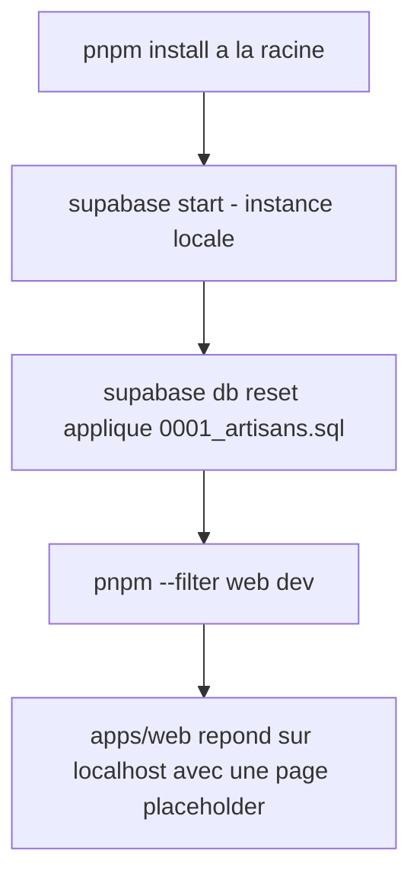

# Instruction: Scaffold monorepo & infra Supabase

## Architecture projection

> Tree of the final files. ✅ create · ✏️ modify · ❌ delete

```txt
.
├── package.json                     ✅ pnpm workspace root
├── pnpm-workspace.yaml              ✅ declares apps/*, packages/*
├── turbo.json                       ✅ build/dev/lint pipeline
├── .env.example                     ✅ Supabase env var names, no secrets
├── apps/
│   └── web/
│       ├── package.json             ✅
│       ├── next.config.ts           ✅
│       └── app/
│           ├── layout.tsx           ✅ root layout, placeholder shell
│           └── page.tsx             ✅ placeholder landing page
├── packages/
│   ├── db/
│   │   ├── package.json             ✅
│   │   └── client.ts                ✅ browser + server Supabase client factories
│   └── ui/
│       ├── package.json             ✅
│       └── src/
│           ├── Input.tsx            ✅ primitive form input
│           └── Button.tsx           ✅ primitive button
└── supabase/
    ├── config.toml                  ✅ local Supabase CLI config
    └── migrations/
        └── 0001_artisans.sql        ✅ artisans table, RLS enabled, no policies yet
```

## User Journey



## Tasks to do

### `1)` Initialiser le workspace pnpm

> Un seul point d'entrée pour installer et orchestrer apps/ et packages/.

1. Créer `package.json` racine (nom, `private: true`, scripts `dev`/`build`/`lint` délégués via Turborepo).
2. Créer `pnpm-workspace.yaml` déclarant `apps/*` et `packages/*`.
3. Créer `turbo.json` avec les tâches `dev`, `build`, `lint`.

### `2)` Scaffolder `apps/web` en Next.js 15 App Router

> Une app qui démarre, sans logique métier.

1. Créer `apps/web/package.json` avec les dépendances Next.js 15 + TypeScript.
2. Créer `apps/web/next.config.ts` minimal.
3. Créer `apps/web/app/layout.tsx` et `apps/web/app/page.tsx` (placeholder).

### `3)` Créer `packages/db` avec les clients Supabase

> Un point unique pour parler à Supabase, réutilisable par toutes les futures features.

1. Créer `packages/db/package.json`.
2. Créer `packages/db/client.ts` exportant un client Supabase côté navigateur et un côté serveur, lisant les variables d'environnement (`SUPABASE_URL`, `SUPABASE_ANON_KEY`, `SUPABASE_SERVICE_ROLE_KEY`).

### `4)` Initialiser Supabase et la première migration

> La table `artisans` existe, protégée par RLS dès sa création.

1. Créer `supabase/config.toml` (projet local, région à épingler en `fra1` en configuration distante).
2. Créer `supabase/migrations/0001_artisans.sql` : table `artisans` (id lié à `auth.users`, siret, corps_metier, created_at), RLS activée sans policy (deny-all par défaut).

### `5)` Créer `packages/ui` avec les primitives de formulaire

> Les futurs écrans d'inscription/connexion réutilisent les mêmes briques.

1. Créer `packages/ui/package.json`.
2. Créer `packages/ui/src/Input.tsx` et `packages/ui/src/Button.tsx`, composants minimaux sans logique métier.

### `6)` Documenter les variables d'environnement

> Un développeur sait quoi renseigner sans deviner.

1. Créer `.env.example` avec les noms de variables Supabase, sans valeur réelle.

## Test acceptance criteria

| Task | Acceptance criteria                                                                          |
| ---- | ---------------------------------------------------------------------------------------------- |
| 1    | `pnpm install` à la racine réussit et résout les deux workspaces (`apps/web`, `packages/*`).     |
| 2    | `pnpm --filter web dev` démarre un serveur qui répond avec la page placeholder.                 |
| 3    | Importer `packages/db` depuis `apps/web` ne lève aucune erreur au build quand les env vars sont définies. |
| 4    | `supabase db reset` applique la migration et crée la table `artisans` avec RLS activée.         |
| 5    | `Input` et `Button` de `packages/ui` sont importables et rendables sans erreur.                 |
| 6    | `.env.example` liste toutes les variables consommées par `packages/db`, aucune valeur secrète.  |
