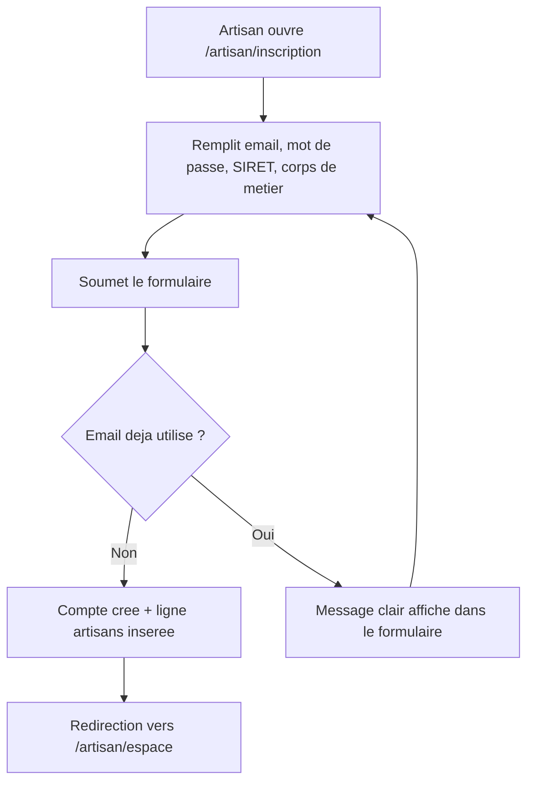

# Instruction: Inscription artisan

## Architecture projection

> Tree of the final files. ✅ create · ✏️ modify · ❌ delete

```txt
.
├── apps/
│   └── web/
│       └── app/
│           ├── (public)/
│           │   └── artisan/
│           │       └── inscription/
│           │           └── page.tsx        ✅ formulaire d'inscription
│           └── api/
│               └── artisan/
│                   └── signup/
│                       └── route.ts        ✅ Route Handler: signUp + insert artisans
└── supabase/
    └── migrations/
        └── 0002_artisans_rls_insert.sql    ✅ policy: un utilisateur insère sa propre ligne artisans
```

## User Journey



## Wireframe

```txt
┌─────────────────────────────────────────────┐
│ (1) Header: logo Alpha CIL                    │
├─────────────────────────────────────────────┤
│ (2) Formulaire d'inscription artisan          │
│   ┌───────────────────────────────────────┐  │
│   │ (3) Champ email                        │  │
│   │ (4) Champ mot de passe                 │  │
│   │ (5) Champ SIRET                        │  │
│   │ (6) Selecteur corps de metier           │  │
│   │ (7) Bouton "Creer mon compte"           │  │
│   └───────────────────────────────────────┘  │
│ (8) Message d'erreur (email deja utilise)     │
│ (9) Lien "Deja un compte ? Se connecter"      │
└─────────────────────────────────────────────┘
```

1. Header : identité minimale de la marque.
2. Formulaire : bloc central unique, pas de distraction.
3. Email : identifiant de connexion.
4. Mot de passe : création du compte.
5. SIRET : identifie l'entreprise artisan.
6. Corps de métier : liste déroulante (plombier, électricien, couvreur...).
7. CTA principal : soumet l'inscription.
8. Erreur : apparaît seulement si l'email est déjà utilisé.
9. Lien secondaire : bascule vers la connexion (phase 3).

## Tasks to do

### `1)` Construire l'écran d'inscription

> Le formulaire tel que dessiné dans le wireframe, sans logique métier côté client au-delà de la validation de saisie.

1. Créer `apps/web/app/(public)/artisan/inscription/page.tsx`.
2. Utiliser `Input`/`Button` de `packages/ui` pour les 4 champs et le CTA.
3. Réserver une zone d'erreur (région 8) masquée par défaut.
4. Ajouter le lien vers `/artisan/connexion` (région 9).

### `2)` Implémenter la Route Handler d'inscription

> Un seul point d'entrée serveur qui crée le compte auth et la ligne artisan de façon atomique du point de vue utilisateur.

1. Créer `apps/web/app/api/artisan/signup/route.ts`.
2. Appeler `supabase.auth.signUp` avec l'email et le mot de passe reçus.
3. Sur succès, insérer une ligne dans `artisans` (id = uid retourné, siret, corps_metier).
4. Retourner un statut de succès avec l'id de session, ou une erreur typée.

### `3)` Gérer l'email déjà utilisé

> Le formulaire ne crée jamais de ligne artisan partielle si le compte auth existe déjà.

1. Détecter l'erreur Supabase Auth "already registered" dans la Route Handler.
2. Retourner un message clair et stable au front, sans créer de ligne `artisans`.
3. Afficher ce message dans la zone d'erreur du formulaire (région 8), sans recharger la page.

### `4)` Ajouter la policy RLS d'insertion

> Un artisan authentifié ne peut insérer que sa propre ligne, jamais celle d'un autre.

1. Créer `supabase/migrations/0002_artisans_rls_insert.sql` : policy `insert` sur `artisans` où `auth.uid() = id`.

### `5)` Rediriger vers l'espace artisan après succès

> L'inscription se termine par un accès immédiat, pas par un écran mort.

1. Sur réponse de succès de la Route Handler, rediriger le client vers `/artisan/espace`.

## Test acceptance criteria

| Task | Acceptance criteria                                                                                  |
| ---- | -------------------------------------------------------------------------------------------------------- |
| 1    | La page `/artisan/inscription` affiche les 4 champs, le CTA et le lien vers la connexion.                 |
| 2    | Une soumission valide crée un utilisateur Supabase Auth et une ligne `artisans` correspondante.            |
| 3    | Soumettre un email déjà enregistré affiche le message d'erreur dans le formulaire et ne crée aucune ligne `artisans` orpheline. |
| 4    | Une tentative d'insertion dans `artisans` pour un autre `id` que le sien échoue (policy RLS refuse).       |
| 5    | Une inscription réussie redirige vers `/artisan/espace` sans action supplémentaire de l'utilisateur.       |
