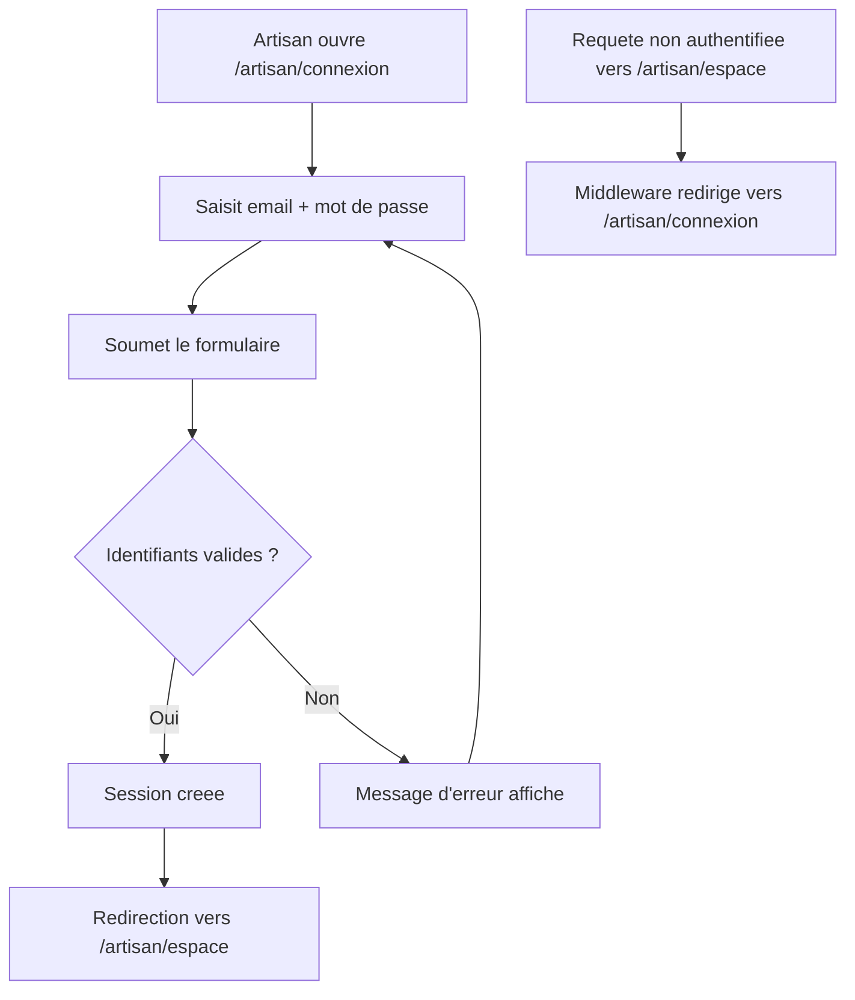

# Instruction: Connexion et espace artisan

## Architecture projection

> Tree of the final files. ✅ create · ✏️ modify · ❌ delete

```txt
.
├── apps/
│   └── web/
│       ├── middleware.ts                        ✏️ protège les routes (artisan)/*
│       └── app/
│           ├── (public)/
│           │   └── artisan/
│           │       └── connexion/
│           │           └── page.tsx              ✅ formulaire de connexion
│           └── (artisan)/
│               └── espace/
│                   └── page.tsx                   ✅ shell authentifié
```

## User Journey



## Wireframe

```txt
┌─────────────────────────────────────────────┐
│ (1) Header: logo Alpha CIL                    │
├─────────────────────────────────────────────┤
│ (2) Formulaire de connexion                   │
│   ┌───────────────────────────────────────┐  │
│   │ (3) Champ email                        │  │
│   │ (4) Champ mot de passe                 │  │
│   │ (5) Bouton "Se connecter"               │  │
│   └───────────────────────────────────────┘  │
│ (6) Message d'erreur (identifiants invalides)  │
│ (7) Lien "Pas de compte ? S'inscrire"          │
└─────────────────────────────────────────────┘

┌─────────────────────────────────────────────┐
│ (1) Header: logo · nom artisan · deconnexion  │
├───────────┬───────────────────────────────────┤
│ (2) Nav   │ (3) Contenu: "Bienvenue" + invite │
│  Mes      │   a soumettre une premiere         │
│  interv.  │   intervention                     │
└───────────┴───────────────────────────────────┘
```

1. Header (connexion) : identité minimale de la marque.
2. Formulaire : email + mot de passe, rien d'autre.
3. Email : identifiant de connexion.
4. Mot de passe : authentification.
5. CTA principal : soumet la connexion.
6. Erreur : identifiants invalides, message générique (pas de fuite d'information sur l'existence du compte).
7. Lien secondaire : bascule vers l'inscription.
8. Header (espace) : identité connectée + action de déconnexion.
9. Nav : entrée "Mes interventions" (contenu détaillé hors scope, US-05).
10. Contenu : confirme l'accès, état d'accueil minimal.

## Tasks to do

### `1)` Construire l'écran de connexion

> Le formulaire minimal tel que dessiné, avec lien vers l'inscription.

1. Créer `apps/web/app/(public)/artisan/connexion/page.tsx`.
2. Utiliser `Input`/`Button` de `packages/ui` pour email, mot de passe, CTA.
3. Réserver une zone d'erreur (région 6) masquée par défaut.
4. Ajouter le lien vers `/artisan/inscription` (région 7).

### `2)` Implémenter la connexion via Supabase Auth

> Une session valide se crée sans exposer si l'échec vient de l'email ou du mot de passe.

1. Appeler `supabase.auth.signInWithPassword` avec email et mot de passe.
2. Sur succès, rediriger vers `/artisan/espace`.
3. Sur échec, afficher un message générique "identifiants invalides" dans la région 6, sans préciser lequel des deux champs est en cause.

### `3)` Protéger les routes de l'espace artisan

> Aucune page de `(artisan)/*` n'est accessible sans session valide.

1. Modifier `apps/web/middleware.ts` : rafraîchir la session, et rediriger vers `/artisan/connexion` toute requête non authentifiée vers `(artisan)/*`.

### `4)` Construire le shell de l'espace artisan

> Une page qui confirme l'accès post-inscription/connexion, socle des futures stories artisan.

1. Créer `apps/web/app/(artisan)/espace/page.tsx` avec header (nom artisan + déconnexion), nav placeholder ("Mes interventions"), contenu d'accueil.

### `5)` Implémenter la déconnexion

> Un artisan quitte sa session en un geste, depuis n'importe quelle page de son espace.

1. Ajouter l'action de déconnexion dans le header de l'espace (région 8), appelant `supabase.auth.signOut` puis redirigeant vers `/artisan/connexion`.

## Test acceptance criteria

| Task | Acceptance criteria                                                                              |
| ---- | ---------------------------------------------------------------------------------------------------- |
| 1    | La page `/artisan/connexion` affiche email, mot de passe, CTA et lien vers l'inscription.              |
| 2    | Une connexion avec des identifiants valides redirige vers `/artisan/espace` ; une connexion invalide affiche un message générique sans distinguer email/mot de passe fautif. |
| 3    | Une requête non authentifiée vers `/artisan/espace` est redirigée vers `/artisan/connexion`.           |
| 4    | Après inscription (phase 2) ou connexion réussie, `/artisan/espace` affiche le header et le contenu d'accueil. |
| 5    | Cliquer sur déconnexion invalide la session et renvoie vers `/artisan/connexion`.                       |
