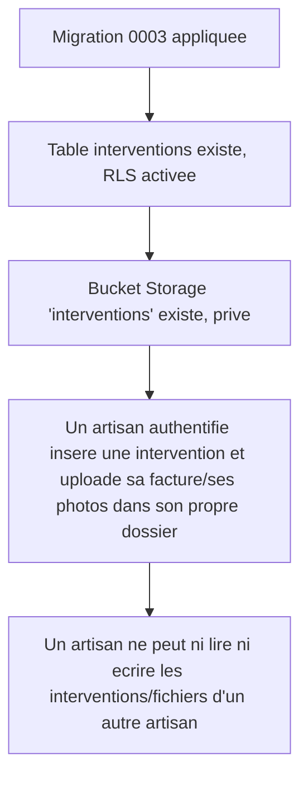

# Instruction: Schéma interventions & stockage factures

## Architecture projection

> Tree of the final files. ✅ create · ✏️ modify · ❌ delete

```txt
.
└── supabase/
    └── migrations/
        └── 0003_interventions.sql   ✅ table interventions, RLS insert/select propriétaire, bucket + policies de stockage
```

## User Journey



## Tasks to do

### `1)` Créer la table `interventions`

> Le socle relationnel pour toute intervention déclarée, avec un statut de vérification typé.

1. Créer `supabase/migrations/0003_interventions.sql`.
2. Définir `create type public.intervention_statut as enum ('en_attente_verification')` — étendu par une future migration quand US-03 ajoutera les statuts de vérification.
3. Colonnes : `id uuid primary key default gen_random_uuid()`, `artisan_id uuid not null references public.artisans(id) on delete cascade`, `type_travaux text not null`, `date_intervention date not null`, `montant_euros numeric(10,2) not null check (montant_euros > 0)`, `corps_metier public.corps_metier not null`, `facture_path text not null`, `photos text[] not null default '{}'`, `statut public.intervention_statut not null default 'en_attente_verification'`, `created_at timestamptz not null default now()`.
4. Activer RLS ; policy `insert` et policy `select`, toutes deux `to authenticated` avec `auth.uid() = artisan_id`.
5. `grant select, insert on public.interventions to authenticated` (le privilège de table, requis avant même l'évaluation RLS — cf. migration 0002).

### `2)` Créer le bucket de stockage des documents d'intervention

> Une facture ou une photo n'est lisible que par l'artisan qui l'a soumise.

1. `insert into storage.buckets (id, name, public, file_size_limit, allowed_mime_types) values ('interventions', 'interventions', false, 10485760, array['application/pdf', 'image/jpeg', 'image/png']);`
2. Policies sur `storage.objects` (`insert`, `select`, toutes deux `to authenticated`) : `(storage.foldername(name))[1] = auth.uid()::text` — l'artisan n'agit que dans son propre dossier `<artisan_id>/...`.
3. `grant select, insert on storage.objects to authenticated`.

## Test acceptance criteria

| Task | Acceptance criteria                                                                                                                                                       |
| ---- | ---------------------------------------------------------------------------------------------------------------------------------------------------------------------- |
| 1    | `supabase db reset` applique la migration ; la table `interventions` existe, RLS activée, statut par défaut `en_attente_verification` ; un artisan ne peut insérer que pour son propre `artisan_id` (policy RLS refuse sinon). |
| 2    | Le bucket `interventions` existe, privé, limité aux PDF/JPEG/PNG de 10 Mo max ; un artisan peut uploader et relire un fichier dans son propre dossier, mais pas dans celui d'un autre artisan. |
