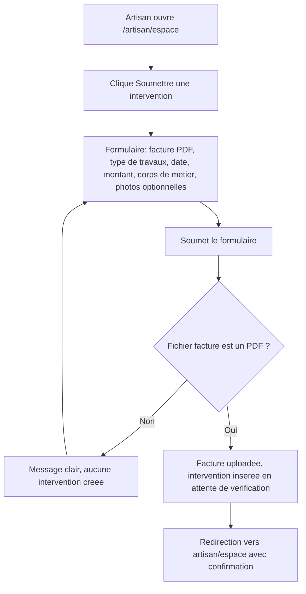

# Instruction: Formulaire de soumission d'intervention

## Architecture projection

> Tree of the final files. ✅ create · ✏️ modify · ❌ delete

```txt
.
└── apps/
    └── web/
        └── app/
            ├── (artisan)/
            │   └── artisan/
            │       └── espace/
            │           ├── page.tsx                          ✏️ ajoute un CTA vers la soumission
            │           └── interventions/
            │               └── nouvelle/
            │                   └── page.tsx                  ✅ formulaire de soumission
            └── api/
                └── artisan/
                    └── interventions/
                        └── route.ts                          ✅ Route Handler : validation + upload + insert
```

## User Journey



## Wireframe

```txt
┌─────────────────────────────────────────────────┐
│ (1) Header: logo · email artisan · déconnexion    │
├───────────┬───────────────────────────────────────┤
│ (2) Nav   │ (3) Formulaire de soumission           │
│  Mes      │   ┌───────────────────────────────┐   │
│  interv.  │   │ (4) Zone d'upload facture (PDF)  │   │
│           │   │ (5) Champ type de travaux        │   │
│           │   │ (6) Champ date                   │   │
│           │   │ (7) Champ montant                │   │
│           │   │ (8) Sélecteur corps de métier     │   │
│           │   │ (9) Zone photos avant/après (opt) │   │
│           │   │ (10) Bouton "Soumettre"           │   │
│           │   └───────────────────────────────┘   │
│           │ (11) Message d'erreur                 │
└───────────┴───────────────────────────────────────┘
```

1. Header : identique à l'espace artisan existant.
2. Nav : entrée "Mes interventions" existante (liste détaillée hors scope, US-05).
3. Formulaire : bloc de saisie unique, un seul écran.
4. Facture : champ fichier, PDF uniquement, requis.
5. Type de travaux : texte libre court, requis.
6. Date : date de l'intervention, requise.
7. Montant : montant en euros, requis, positif.
8. Corps de métier : même liste que l'inscription artisan.
9. Photos avant/après : upload fichier multiple, optionnel, jamais bloquant.
10. CTA : soumet l'intervention.
11. Erreur : fichier non-PDF, ou échec de soumission.

## Tasks to do

### `1)` Construire l'écran de soumission

> Le formulaire tel que dessiné, réutilisant les primitives de `packages/ui`.

1. Créer `apps/web/app/(artisan)/artisan/espace/interventions/nouvelle/page.tsx`.
2. Utiliser `Input`, `Select`, `Button`, `Alert` de `packages/ui` pour les champs, le CTA et la zone d'erreur (régions 5-8, 10, 11).
3. Ajouter un champ fichier natif pour la facture (région 4, PDF uniquement) et un champ fichier multiple pour les photos (région 9, optionnel).
4. Depuis `apps/web/app/(artisan)/artisan/espace/page.tsx`, ajouter un lien/CTA vers ce formulaire.

### `2)` Implémenter la Route Handler de soumission

> Un seul point d'entrée serveur qui valide le fichier, l'upload, et insère l'intervention de façon atomique du point de vue utilisateur.

1. Créer `apps/web/app/api/artisan/interventions/route.ts`, acceptant un `multipart/form-data`.
2. Vérifier la session artisan via le client Supabase serveur ; sans session, retourner une erreur d'authentification.
3. Vérifier que le fichier facture est bien de type `application/pdf` avant tout upload ; sinon retourner une erreur typée sans upload ni insertion.
4. Uploader la facture dans le bucket `interventions`, sous `<artisan_id>/facture-<uuid>.pdf`.
5. Insérer la ligne `interventions` (artisan_id, type_travaux, date_intervention, montant_euros, corps_metier, facture_path, statut par défaut).
6. Si l'upload réussit mais que l'insertion échoue, supprimer le fichier uploadé pour ne laisser aucune facture orpheline.
7. Retourner un statut de succès, ou une erreur typée.

### `3)` Gérer le fichier non supporté

> Un fichier non-PDF échoue proprement, sans upload ni intervention partielle.

1. Détecter un type MIME différent de `application/pdf` avant tout upload ou insertion.
2. Retourner un message clair et stable au front.
3. Afficher ce message dans la zone d'erreur du formulaire (région 11), sans recharger la page.

### `4)` Gérer les photos avant/après sans jamais bloquer

> L'absence ou l'échec des photos ne doit jamais empêcher la création de l'intervention.

1. Si des photos sont présentes, les uploader dans le bucket sous `<artisan_id>/photo-<uuid>.<ext>` et stocker leurs chemins dans la colonne `photos`.
2. Une erreur d'upload d'une photo est ignorée pour la création de l'intervention : la facture et les champs suffisent à valider la soumission.

### `5)` Rediriger vers l'espace artisan après succès

> La soumission se termine par une confirmation visible, pas un écran mort.

1. Sur réponse de succès de la Route Handler, rediriger le client vers `/artisan/espace`.

## Test acceptance criteria

| Task | Acceptance criteria                                                                                                                                       |
| ---- | ------------------------------------------------------------------------------------------------------------------------------------------------------------ |
| 1    | La page de soumission affiche les champs facture, type de travaux, date, montant, corps de métier, photos (optionnel), le CTA, et est accessible depuis `/artisan/espace`. |
| 2    | Une soumission valide (PDF + champs requis) crée une ligne `interventions` en statut `en_attente_verification`, avec la facture accessible dans le bucket. |
| 3    | Soumettre un fichier non-PDF affiche un message d'erreur clair dans le formulaire et ne crée aucune intervention ni upload.                                |
| 4    | Une intervention est créée même sans photo, et même si l'upload d'une photo échoue ; les photos ne sont jamais requises pour valider la soumission.        |
| 5    | Une soumission réussie redirige vers `/artisan/espace`.                                                                                                    |
