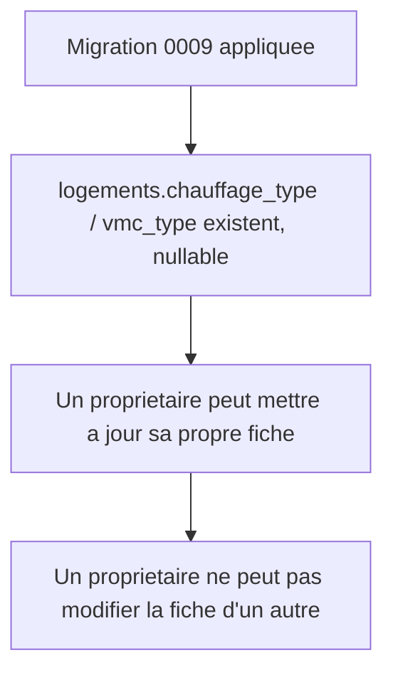

# Instruction: Schéma : équipements de la fiche logement

## Architecture projection

> Tree of the final files. ✅ create · ✏️ modify · ❌ delete

```txt
.
└── supabase/
    └── migrations/
        └── 0009_logement_equipements.sql   ✅ colonnes chauffage/VMC, policy update propriétaire
```

## User Journey



## Tasks to do

### `1)` Ajouter les colonnes d'équipements

> La fiche logement porte deux informations d'équipement, absentes tant que le propriétaire ne les a pas renseignées.

1. Créer `supabase/migrations/0009_logement_equipements.sql`.
2. `create type public.chauffage_type as enum ('gaz', 'electrique', 'bois', 'pompe_a_chaleur', 'autre');`
3. `create type public.vmc_type as enum ('simple_flux', 'double_flux', 'aucune');`
4. `alter table public.logements add column chauffage_type public.chauffage_type, add column vmc_type public.vmc_type;` (nullable : non renseigné par défaut).

### `2)` Autoriser le propriétaire à compléter sa propre fiche

> Aucune policy `update` n'existe encore sur `logements` (seul `select` existait) ; nécessaire pour que le propriétaire renseigne ses équipements.

1. `grant update on public.logements to authenticated;`
2. `create policy "logements_update_owner" on public.logements for update to authenticated using (auth.uid() = proprietaire_id) with check (auth.uid() = proprietaire_id);`

## Test acceptance criteria

| Task | Acceptance criteria                                                                                                                                       |
| ---- | ------------------------------------------------------------------------------------------------------------------------------------------------------------ |
| 1    | `supabase db reset` applique la migration ; `logements` porte `chauffage_type` et `vmc_type`, nullable, sans casser les lignes existantes.                    |
| 2    | Un propriétaire authentifié peut mettre à jour `chauffage_type`/`vmc_type` sur sa propre fiche ; une tentative sur la fiche d'un autre propriétaire échoue.    |
