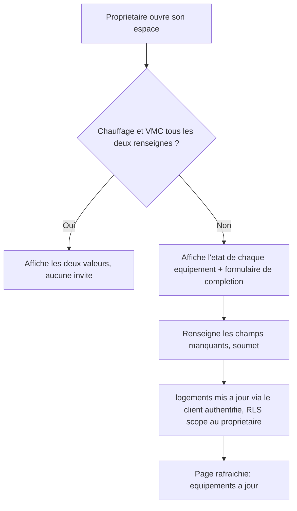

# Instruction: Affichage et complétion dans l'espace propriétaire

## Architecture projection

> Tree of the final files. ✅ create · ✏️ modify · ❌ delete

```txt
.
└── apps/
    └── web/
        └── app/
            └── (owner)/
                └── proprietaire/
                    └── espace/
                        ├── page.tsx               ✏️ affiche l'état des équipements
                        └── EquipementsForm.tsx     ✅ formulaire de complétion (client)
```

## User Journey



## Wireframe

```txt
┌─────────────────────────────────────────────┐
│ (1) Header: logo · email · déconnexion        │
├─────────────────────────────────────────────┤
│ (2) Titre "Mon logement"                       │
│ (3) Adresse                                    │
│ (4) Chauffage : valeur ou "Non renseigné"      │
│ (5) VMC : valeur ou "Non renseigné"            │
│ (6) Formulaire de complétion (si incomplet)    │
│   ┌───────────────────────────────────────┐  │
│   │ (7) Sélecteur type de chauffage         │  │
│   │ (8) Sélecteur type de VMC                │  │
│   │ (9) Bouton "Enregistrer"                 │  │
│   └───────────────────────────────────────┘  │
└─────────────────────────────────────────────┘
```

1-3. Header et adresse déjà existants.
4-5. État actuel de chaque équipement, affiché systématiquement.
6-9. Formulaire de complétion : n'apparaît que si `chauffage_type` ou `vmc_type` est manquant ; les deux champs sont pré-remplis avec la valeur existante s'il y en a une, pour permettre une correction en une seule session.

## Tasks to do

### `1)` Afficher l'état des équipements

> Le propriétaire voit, pour chaque équipement, sa valeur ou son absence.

1. Dans `apps/web/app/(owner)/proprietaire/espace/page.tsx`, étendre la requête `logements` pour inclure `chauffage_type`, `vmc_type`.
2. Afficher chacun avec un libellé lisible, ou "Non renseigné" si `null`.

### `2)` Construire le formulaire de complétion

> Un seul formulaire suffit à compléter tout ce qui manque, jamais affiché si la fiche est déjà complète.

1. Créer `apps/web/app/(owner)/proprietaire/espace/EquipementsForm.tsx` (client) : deux `Select` de `packages/ui` (chauffage, VMC), pré-remplis avec les valeurs existantes.
2. À la soumission, mettre à jour `logements` via `createBrowserSupabaseClient` (RLS scope déjà au propriétaire), puis rafraîchir la page (`router.refresh()`).
3. Dans `page.tsx`, n'afficher ce formulaire que si `chauffage_type` ou `vmc_type` est `null`.

## Test acceptance criteria

| Task | Acceptance criteria                                                                                                                                       |
| ---- | ------------------------------------------------------------------------------------------------------------------------------------------------------------ |
| 1    | L'espace propriétaire affiche la valeur de chaque équipement, ou "Non renseigné" pour celui qui manque.                                                       |
| 2    | Une fiche avec un équipement manquant affiche le formulaire de complétion ; le soumettre met à jour la fiche et fait disparaître l'invite une fois les deux équipements renseignés. Une fiche déjà complète n'affiche aucun formulaire ni invite. |
