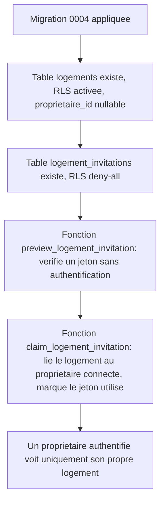

# Instruction: Schéma logements & invitations

## Architecture projection

> Tree of the final files. ✅ create · ✏️ modify · ❌ delete

```txt
.
└── supabase/
    └── migrations/
        └── 0004_logements.sql   ✅ table logements, table logement_invitations, RLS, fonctions SECURITY DEFINER
```

## User Journey



## Tasks to do

### `1)` Créer la table `logements`

> Le socle minimal d'une fiche logement, y compris orpheline (sans propriétaire) en attendant d'être réclamée.

1. Créer `supabase/migrations/0004_logements.sql`.
2. Colonnes : `id uuid primary key default gen_random_uuid()`, `adresse text not null`, `proprietaire_id uuid references auth.users (id) on delete set null`, `created_at timestamptz not null default now()`.
3. Activer RLS ; policy `select` `to authenticated` avec `auth.uid() = proprietaire_id`.
4. `grant select on public.logements to authenticated`.

### `2)` Créer la table `logement_invitations`

> Un jeton d'invitation lié à un logement, à usage unique et à durée limitée.

1. Colonnes : `id uuid primary key default gen_random_uuid()`, `logement_id uuid not null references public.logements (id) on delete cascade`, `token uuid not null default gen_random_uuid() unique`, `expires_at timestamptz not null`, `used_at timestamptz`, `created_at timestamptz not null default now()`.
2. Activer RLS, sans policy (deny-all) : seules les fonctions `SECURITY DEFINER` ci-dessous y accèdent.

### `3)` Créer les fonctions de validation et de réclamation du jeton

> Toute la logique d'invitation passe par ces deux points d'entrée, jamais par un accès direct aux tables.

1. `public.preview_logement_invitation(invitation_token uuid) returns table (adresse text, valid boolean)` : `SECURITY DEFINER`, retourne l'adresse du logement et si le jeton est valide (non expiré, non utilisé), sans rien modifier. `grant execute` à `anon, authenticated` (consultable avant inscription).
2. `public.claim_logement_invitation(invitation_token uuid) returns uuid` : `SECURITY DEFINER`, verrouille la ligne d'invitation, échoue (`raise exception`) si absente, expirée ou déjà utilisée ; sinon associe `logements.proprietaire_id = auth.uid()`, marque l'invitation `used_at = now()`, retourne l'id du logement. `grant execute` à `authenticated` uniquement.

## Test acceptance criteria

| Task | Acceptance criteria                                                                                                                                                       |
| ---- | ---------------------------------------------------------------------------------------------------------------------------------------------------------------------- |
| 1    | `supabase db reset` applique la migration ; la table `logements` existe, RLS activée ; un propriétaire authentifié ne voit que la ligne où `proprietaire_id = auth.uid()`. |
| 2    | La table `logement_invitations` existe, RLS activée, aucun accès direct possible pour `anon`/`authenticated` (deny-all confirmé).                                        |
| 3    | `preview_logement_invitation` retourne l'adresse et `valid = true` pour un jeton frais, `valid = false` pour un jeton expiré ou déjà utilisé, sans authentification requise. `claim_logement_invitation` associe le logement au compte appelant pour un jeton valide, échoue proprement pour un jeton invalide/expiré/déjà utilisé, et un second appel avec le même jeton échoue également. |
