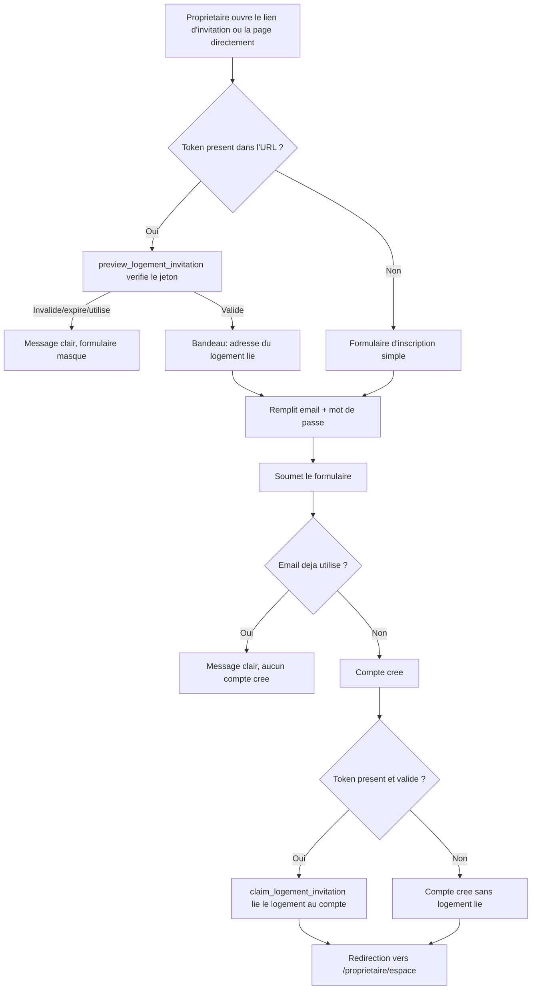

# Instruction: Inscription propriétaire (directe et via invitation)

## Architecture projection

> Tree of the final files. ✅ create · ✏️ modify · ❌ delete

```txt
.
└── apps/
    └── web/
        └── app/
            ├── (public)/
            │   └── proprietaire/
            │       └── inscription/
            │           └── page.tsx        ✅ formulaire d'inscription, avec ou sans ?token=
            └── api/
                └── proprietaire/
                    └── signup/
                        └── route.ts        ✅ Route Handler: signUp + réclamation du jeton si présent
```

## User Journey



## Wireframe

```txt
┌─────────────────────────────────────────────┐
│ (1) Header: logo Alpha CIL                    │
├─────────────────────────────────────────────┤
│ (2) Bandeau adresse (si invitation valide)    │
├─────────────────────────────────────────────┤
│ (3) Formulaire d'inscription propriétaire     │
│   ┌───────────────────────────────────────┐  │
│   │ (4) Champ email                        │  │
│   │ (5) Champ mot de passe                 │  │
│   │ (6) Bouton "Créer mon compte"           │  │
│   └───────────────────────────────────────┘  │
│ (7) Message d'erreur (email déjà utilisé,     │
│      ou invitation invalide/expirée/utilisée) │
│ (8) Lien "Déjà un compte ? Se connecter"      │
└─────────────────────────────────────────────┘
```

1. Header : identité minimale de la marque.
2. Bandeau : n'apparaît que si `?token=` est présent et valide ; affiche l'adresse du logement concerné.
3. Formulaire : bloc central, email + mot de passe uniquement (pas de champ propre au propriétaire).
4-6. Champs standard et CTA.
7. Erreur : email déjà utilisé après soumission, OU jeton invalide/expiré/déjà utilisé détecté au chargement (remplace alors le formulaire, région 3, par ce seul message).
8. Lien secondaire vers la connexion.

## Tasks to do

### `1)` Construire l'écran d'inscription

> Le même écran gère les deux parcours ; seule la présence et la validité du jeton change ce qui s'affiche.

1. Créer `apps/web/app/(public)/proprietaire/inscription/page.tsx`.
2. Lire le paramètre `token` de l'URL ; si présent, appeler `preview_logement_invitation` côté serveur.
3. Si le jeton est invalide, expiré ou déjà utilisé : afficher uniquement le message d'erreur (région 7), masquer le formulaire.
4. Si le jeton est valide : afficher le bandeau (région 2) avec l'adresse, puis le formulaire.
5. Sans jeton : afficher directement le formulaire, sans bandeau.
6. Utiliser `Input`/`Button`/`Alert` de `packages/ui` pour les champs, le CTA et les erreurs. Ajouter le lien vers `/proprietaire/connexion` (région 8).

### `2)` Implémenter la Route Handler d'inscription

> Un seul point d'entrée serveur qui crée le compte et, si un jeton valide est fourni, réclame le logement associé.

1. Créer `apps/web/app/api/proprietaire/signup/route.ts`.
2. Appeler `supabase.auth.signUp` avec l'email et le mot de passe reçus.
3. Sur succès, si un `token` a été transmis, appeler `claim_logement_invitation(token)` ; une erreur de cette étape est retournée au client sans annuler le compte déjà créé.
4. Retourner un statut de succès, ou une erreur typée.

### `3)` Gérer l'email déjà utilisé

> Le formulaire ne crée jamais de compte partiel ni ne consomme un jeton si l'inscription échoue.

1. Détecter l'erreur Supabase Auth "already registered" dans la Route Handler.
2. Retourner un message clair et stable au front, sans appeler `claim_logement_invitation`.
3. Afficher ce message dans la zone d'erreur du formulaire (région 7), sans recharger la page.

### `4)` Rediriger vers l'espace propriétaire après succès

> L'inscription se termine par un accès immédiat, avec ou sans logement lié.

1. Sur réponse de succès de la Route Handler (compte créé, logement réclamé ou non), rediriger le client vers `/proprietaire/espace`.

## Test acceptance criteria

| Task | Acceptance criteria                                                                                                                                       |
| ---- | ------------------------------------------------------------------------------------------------------------------------------------------------------------ |
| 1    | Sans jeton, la page affiche le formulaire d'inscription simple. Avec un jeton valide, elle affiche en plus l'adresse du logement concerné. Avec un jeton invalide/expiré/déjà utilisé, elle affiche uniquement le message d'erreur, sans formulaire. |
| 2    | Une inscription directe (sans jeton) crée un compte sans logement lié. Une inscription avec un jeton valide crée le compte et lie le logement correspondant. |
| 3    | Soumettre un email déjà enregistré affiche le message d'erreur et ne crée ni compte ni réclamation de jeton.                                              |
| 4    | Une inscription réussie (avec ou sans jeton) redirige vers `/proprietaire/espace`.                                                                        |
