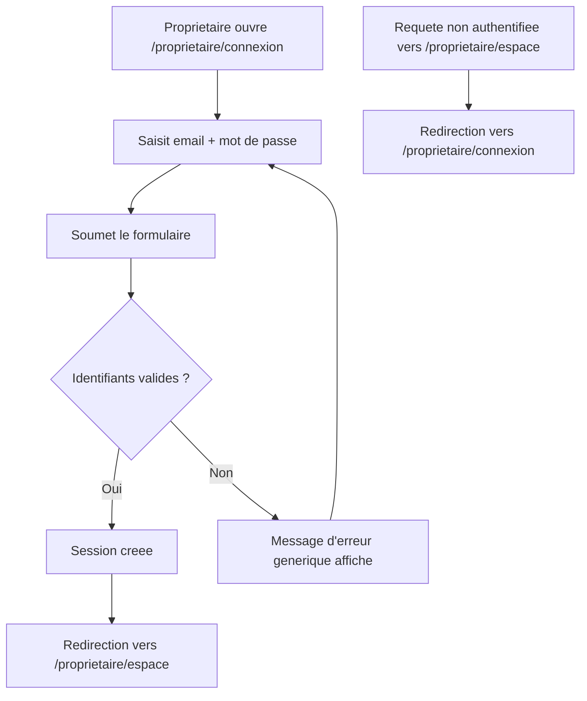

# Instruction: Connexion et espace propriétaire

## Architecture projection

> Tree of the final files. ✅ create · ✏️ modify · ❌ delete

```txt
.
└── apps/
    └── web/
        ├── middleware.ts                          ✏️ étend le refresh de session à (owner)/*
        └── app/
            ├── (public)/
            │   └── proprietaire/
            │       └── connexion/
            │           └── page.tsx                ✅ formulaire de connexion
            └── (owner)/
                └── proprietaire/
                    └── espace/
                        ├── page.tsx                 ✅ shell authentifié
                        └── SignOutButton.tsx         ✅ déconnexion
```

## User Journey



## Wireframe

```txt
┌─────────────────────────────────────────────┐
│ (1) Header: logo Alpha CIL                    │
├─────────────────────────────────────────────┤
│ (2) Formulaire de connexion                   │
│   ┌───────────────────────────────────────┐  │
│   │ (3) Champ email                        │  │
│   │ (4) Champ mot de passe                 │  │
│   │ (5) Bouton "Se connecter"               │  │
│   └───────────────────────────────────────┘  │
│ (6) Message d'erreur (identifiants invalides)  │
│ (7) Lien "Pas de compte ? S'inscrire"          │
└─────────────────────────────────────────────┘

┌─────────────────────────────────────────────┐
│ (8) Header: logo · email · déconnexion        │
├─────────────────────────────────────────────┤
│ (9) Contenu: adresse du logement lié           │
│      ou invite si aucun logement pour l'instant│
└─────────────────────────────────────────────┘
```

1. Header (connexion) : identité minimale de la marque.
2. Formulaire : email + mot de passe, rien d'autre.
3-5. Champs standard et CTA.
6. Erreur : identifiants invalides, message générique.
7. Lien secondaire vers l'inscription.
8. Header (espace) : identité connectée + déconnexion.
9. Contenu : adresse du logement lié (via `logements` où `proprietaire_id = auth.uid()`), ou un message si aucun logement n'est encore lié.

## Tasks to do

### `1)` Construire l'écran de connexion

> Le formulaire minimal, identique dans l'esprit à celui de l'artisan.

1. Créer `apps/web/app/(public)/proprietaire/connexion/page.tsx`.
2. Utiliser `Input`/`Button`/`Alert` de `packages/ui` pour email, mot de passe, CTA, erreur.
3. Ajouter le lien vers `/proprietaire/inscription` (région 7).

### `2)` Implémenter la connexion via Supabase Auth

> Une session valide se crée sans exposer si l'échec vient de l'email ou du mot de passe.

1. Appeler `supabase.auth.signInWithPassword` avec email et mot de passe.
2. Sur succès, rediriger vers `/proprietaire/espace`.
3. Sur échec, afficher un message générique "identifiants invalides" (région 6).

### `3)` Étendre le rafraîchissement de session à l'espace propriétaire

> Le middleware ne fait toujours que rafraîchir la session, jamais de contrôle d'accès (voir la décision déjà actée pour l'espace artisan).

1. Modifier `apps/web/middleware.ts` : étendre le `matcher` pour couvrir `/proprietaire/espace/:path*` en plus de `/artisan/espace/:path*`.

### `4)` Construire le shell de l'espace propriétaire

> Une page protégée qui affiche le logement lié, ou son absence, sans jamais planter.

1. Créer `apps/web/app/(owner)/proprietaire/espace/page.tsx` : Server Component qui vérifie la session (redirige vers `/proprietaire/connexion` si absente), requête `logements` (RLS restreint déjà à `proprietaire_id = auth.uid()`), affiche l'adresse si une ligne existe, sinon un message d'absence de logement.
2. Ajouter le header (email + déconnexion), identique dans l'esprit à celui de l'espace artisan.

### `5)` Implémenter la déconnexion

> Un propriétaire quitte sa session en un geste.

1. Créer `apps/web/app/(owner)/proprietaire/espace/SignOutButton.tsx`, appelant `supabase.auth.signOut` puis redirigeant vers `/proprietaire/connexion`.

## Test acceptance criteria

| Task | Acceptance criteria                                                                                              |
| ---- | ---------------------------------------------------------------------------------------------------------------------- |
| 1    | La page `/proprietaire/connexion` affiche email, mot de passe, CTA et lien vers l'inscription.                          |
| 2    | Une connexion avec des identifiants valides redirige vers `/proprietaire/espace` ; une connexion invalide affiche un message générique. |
| 3    | Une requête non authentifiée vers `/proprietaire/espace` est redirigée vers `/proprietaire/connexion`.                  |
| 4    | Un propriétaire avec un logement lié voit son adresse dans son espace ; un propriétaire sans logement lié voit un message d'absence, pas une erreur. |
| 5    | Cliquer sur déconnexion invalide la session et renvoie vers `/proprietaire/connexion`.                                  |
