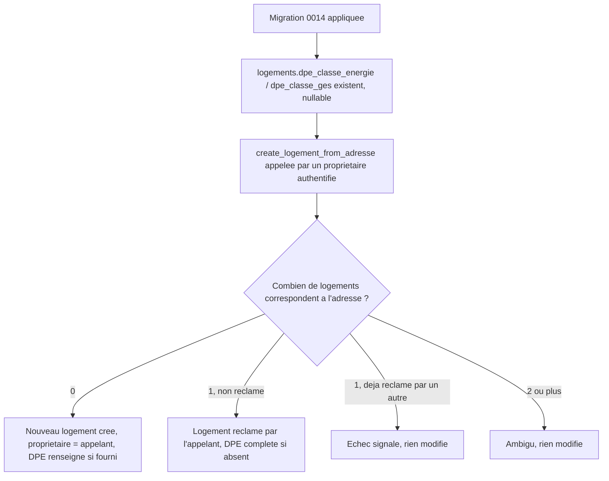

# Instruction: Schéma : champs DPE et fonction de création/réclamation

## Architecture projection

> Tree of the final files. ✅ create · ✏️ modify · ❌ delete

```txt
.
└── supabase/
    └── migrations/
        └── 0014_creation_fiche_manuelle.sql   ✅ colonnes DPE sur logements, fonction create_logement_from_adresse
```

## User Journey



## Tasks to do

### `1)` Ajouter les champs DPE

> Une fiche logement porte sa classe énergie et sa classe GES, absentes tant qu'aucun DPE n'a été trouvé.

1. Créer `supabase/migrations/0014_creation_fiche_manuelle.sql`.
2. `alter table public.logements add column dpe_classe_energie text, add column dpe_classe_ges text;`

### `2)` Créer la fonction de création/réclamation par adresse

> Un propriétaire peut vérifier si une fiche existe déjà pour son adresse et la réclamer, ou en créer une nouvelle, sans jamais accéder aux logements d'un autre propriétaire.

1. `public.create_logement_from_adresse(p_adresse text, p_dpe_classe_energie text, p_dpe_classe_ges text) returns table (logement_id uuid, created boolean, success boolean)`, `SECURITY DEFINER`.
2. Recherche les logements dont l'adresse normalisée (`trim`, `lower`) correspond exactement à `p_adresse` normalisée (même normalisation que `match_or_create_logement` de US-04).
3. Zéro correspondance : crée un nouveau logement avec `proprietaire_id = auth.uid()` et les champs DPE fournis ; retourne `created = true`, `success = true`.
4. Une correspondance, `proprietaire_id` nul : associe `proprietaire_id = auth.uid()` ; complète les champs DPE uniquement s'ils étaient vides ; retourne `created = false`, `success = true`.
5. Une correspondance, `proprietaire_id` déjà renseigné (et différent de l'appelant) : ne modifie rien, retourne `success = false`, `logement_id = null`.
6. Deux correspondances ou plus : ne modifie rien, retourne `success = false`, `logement_id = null`.
7. `grant execute on function public.create_logement_from_adresse(text, text, text) to authenticated`.

## Test acceptance criteria

| Task | Acceptance criteria                                                                                                                                       |
| ---- | ------------------------------------------------------------------------------------------------------------------------------------------------------------ |
| 1    | `supabase db reset` applique la migration ; les colonnes DPE existent, nullable.                                                                              |
| 2    | Pour une adresse inconnue, un nouveau logement est créé avec l'appelant comme propriétaire et le DPE fourni. Pour une adresse d'un logement non réclamé, l'appelant en devient propriétaire. Pour une adresse déjà réclamée par un autre, ou correspondant à plusieurs logements, rien n'est modifié et l'échec est signalé. |
