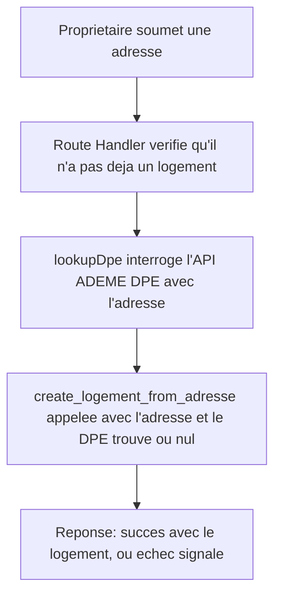

# Instruction: Client DPE (`packages/logement`) et câblage

## Architecture projection

> Tree of the final files. ✅ create · ✏️ modify · ❌ delete

```txt
.
├── packages/
│   └── logement/
│       ├── package.json           ✅ nouveau package
│       ├── tsconfig.json          ✅
│       └── src/
│           ├── index.ts           ✅ export public
│           └── dpe.ts             ✅ lookupDpe(adresse)
└── apps/
    └── web/
        ├── package.json                          ✏️ dépendance @alpha-cil/logement
        └── app/
            └── api/
                └── proprietaire/
                    └── logement/
                        └── route.ts               ✅ Route Handler : lookupDpe + create_logement_from_adresse

## User Journey



## Tasks to do

### `1)` Créer le package `packages/logement`

> Le module responsable du DPE, distinct de `packages/intervention` (RGE) comme documenté dans INSTALL.md.

1. Créer `packages/logement/package.json` (nom `@alpha-cil/logement`, `main`/`types` vers `src/index.ts`), `packages/logement/tsconfig.json` (même forme que `packages/db`/`packages/intervention`).
2. Créer `packages/logement/src/dpe.ts` exportant `lookupDpe(adresse: string): Promise<{ classeEnergie: string; classeGes: string } | null>` :
   - Interroge `https://data.ademe.fr/data-fair/api/v1/datasets/dpe03existant/lines?q=${encodeURIComponent(adresse)}&size=1`.
   - Retourne `{ classeEnergie: etiquette_dpe, classeGes: etiquette_ges }` du premier résultat s'il existe, `null` sinon.
   - Toute erreur réseau ou réponse invalide est interceptée et traitée comme `null` (jamais propagée en exception), même posture de résilience que `verifyRge`.
3. Créer `packages/logement/src/index.ts` exportant `lookupDpe`.

### `2)` Câbler la Route Handler de création de fiche

> La création de fiche échoue proprement si le propriétaire en a déjà une, et n'est jamais bloquée par l'absence de DPE.

1. Ajouter `@alpha-cil/logement` aux dépendances de `apps/web/package.json`.
2. Créer `apps/web/app/api/proprietaire/logement/route.ts` (`POST`), body `{ adresse: string }`.
3. Vérifie la session propriétaire ; si le propriétaire a déjà un logement (`select` existant), retourne une erreur typée sans rien créer.
4. Appelle `lookupDpe(adresse)` ; appelle ensuite `create_logement_from_adresse(adresse, classeEnergie ?? null, classeGes ?? null)`.
5. Retourne un succès avec l'id du logement, ou une erreur typée si `success = false` (adresse déjà réclamée par un autre, ou ambiguë).

## Test acceptance criteria

| Task | Acceptance criteria                                                                                                                                       |
| ---- | ------------------------------------------------------------------------------------------------------------------------------------------------------------ |
| 1    | `lookupDpe` retourne les classes énergie/GES pour une adresse réellement présente dans les données DPE (testé contre l'API réelle), `null` pour une adresse inconnue ou si l'API est injoignable. |
| 2    | Un propriétaire sans logement peut en créer un ; le DPE est renseigné automatiquement s'il est trouvé, absent sinon, sans jamais bloquer la création. Un propriétaire ayant déjà un logement reçoit une erreur claire sans double création. |
