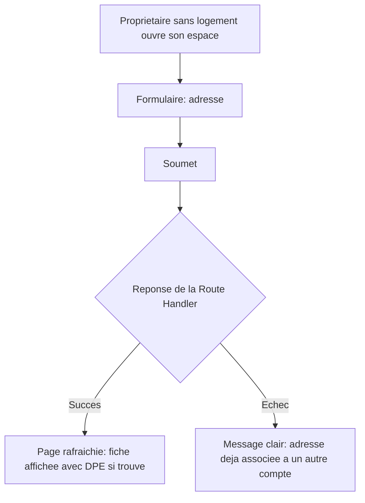

# Instruction: Écran de création de fiche

## Architecture projection

> Tree of the final files. ✅ create · ✏️ modify · ❌ delete

```txt
.
└── apps/
    └── web/
        └── app/
            └── (owner)/
                └── proprietaire/
                    └── espace/
                        ├── page.tsx                ✏️ affiche le formulaire quand aucun logement n'est lié
                        └── CreerFicheForm.tsx        ✅ formulaire de création par adresse (client)
```

## User Journey



## Wireframe

```txt
┌─────────────────────────────────────────────┐
│ (1) Titre "Créer ma fiche logement"            │
│ (2) Champ adresse                              │
│ (3) Bouton "Créer ma fiche"                    │
│ (4) Message d'erreur (si échec)                │
└─────────────────────────────────────────────┘
```

1. Titre : remplace le message "Aucun logement lié" quand le propriétaire n'en a pas encore.
2. Adresse : texte libre, requis.
3. CTA : soumet la création.
4. Erreur : affichée si l'adresse est déjà associée à un autre compte, ou ambiguë.

## Tasks to do

### `1)` Construire le formulaire de création

> Un propriétaire sans fiche peut en créer une à partir d'une simple adresse, sans jamais bloquer sur l'absence de DPE.

1. Créer `apps/web/app/(owner)/proprietaire/espace/CreerFicheForm.tsx` (client) : `Input`/`Button`/`Alert` de `packages/ui`, soumet à `POST /api/proprietaire/logement`, rafraîchit la page (`router.refresh()`) sur succès.
2. Dans `apps/web/app/(owner)/proprietaire/espace/page.tsx`, remplacer le message "Aucun logement n'est encore lié à votre compte" par ce formulaire quand `logement` est `null`.
3. Afficher les champs DPE (classe énergie, classe GES, ou "Non disponible") dans l'affichage existant du logement, une fois la fiche créée.

## Test acceptance criteria

| Task | Acceptance criteria                                                                                                                                       |
| ---- | ------------------------------------------------------------------------------------------------------------------------------------------------------------ |
| 1    | Un propriétaire sans logement voit le formulaire de création. Le soumettre avec une adresse dont le DPE est trouvé affiche la fiche avec sa classe énergie/GES ; avec une adresse sans DPE, la fiche est créée sans ce champ, sans blocage. Une adresse déjà associée à un autre compte affiche un message d'erreur clair, sans rien créer. |
