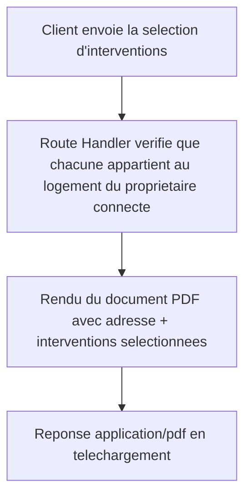

# Instruction: Génération du PDF

## Architecture projection

> Tree of the final files. ✅ create · ✏️ modify · ❌ delete

```txt
.
└── apps/
    └── web/
        ├── package.json                                       ✏️ dépendance @react-pdf/renderer
        └── app/
            ├── (owner)/
            │   └── proprietaire/
            │       └── espace/
            │           └── export/
            │               └── CarnetDocument.tsx              ✅ mise en page PDF (composants @react-pdf/renderer)
            └── api/
                └── proprietaire/
                    └── export/
                        └── pdf/
                            └── route.ts                         ✅ Route Handler : génère et retourne le PDF
```

## User Journey



## Tasks to do

### `1)` Ajouter `@react-pdf/renderer`

> La mise en page du PDF s'écrit en composants React, cohérent avec la stack déjà en place.

1. Ajouter `@react-pdf/renderer` aux dépendances de `apps/web/package.json`.

### `2)` Construire le document PDF

> Le PDF ne contient jamais que l'adresse du logement et les interventions explicitement sélectionnées.

1. Créer `apps/web/app/(owner)/proprietaire/espace/export/CarnetDocument.tsx` : composant `@react-pdf/renderer` prenant en props l'adresse et une liste d'interventions (date, type de travaux, artisan SIRET, statut RGE horodaté, mention décennale déclarative) ; affiche un état "Aucune intervention sélectionnée" si la liste est vide.

### `3)` Implémenter la Route Handler de génération

> Seules les interventions du logement du propriétaire connecté peuvent apparaître dans le PDF, jamais celles d'un autre logement.

1. Créer `apps/web/app/api/proprietaire/export/pdf/route.ts` (`POST`), body `{ interventionIds: string[] }`.
2. Vérifie la session propriétaire, récupère son logement.
3. Requête `interventions` filtrée par `logement_id` du propriétaire ET `id in (interventionIds)` (RLS restreint déjà aux interventions de son logement ; l'intersection avec `interventionIds` garantit qu'aucune intervention non sélectionnée n'apparaît).
4. Rend `CarnetDocument` avec le résultat (peut être une liste vide) et retourne un flux `application/pdf` avec `Content-Disposition: attachment`.

## Test acceptance criteria

| Task | Acceptance criteria                                                                                                                                       |
| ---- | ------------------------------------------------------------------------------------------------------------------------------------------------------------ |
| 1    | La dépendance s'installe et le projet compile.                                                                                                                 |
| 2    | Le composant rend un document PDF valide contenant exactement les interventions passées en props, et un état vide explicite si la liste est vide.             |
| 3    | Appeler la route avec une sélection retourne un PDF ne contenant que ces interventions ; une intervention id n'appartenant pas au logement du propriétaire connecté est silencieusement exclue (jamais incluse) ; une sélection vide retourne un PDF avec l'état vide, pas une erreur. |
