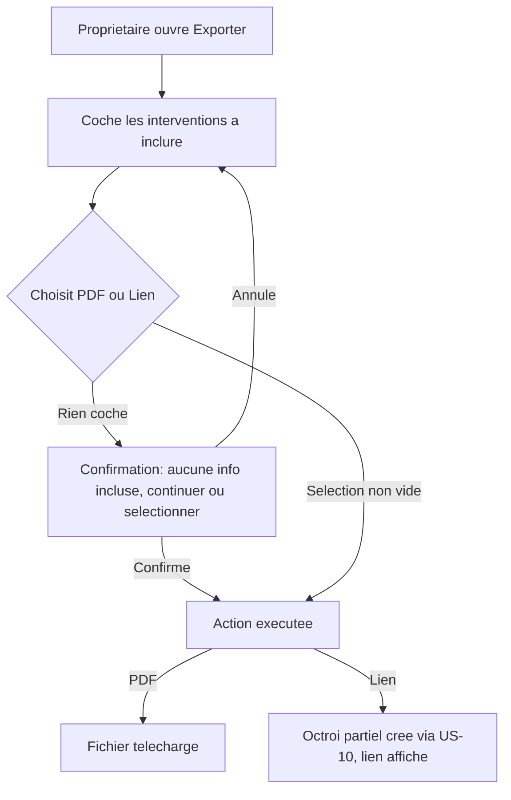

# Instruction: Écran d'export : sélection, lien, PDF, confirmation à vide

## Architecture projection

> Tree of the final files. ✅ create · ✏️ modify · ❌ delete

```txt
.
└── apps/
    └── web/
        └── app/
            └── (owner)/
                └── proprietaire/
                    └── espace/
                        ├── page.tsx            ✏️ lien de nav vers l'export
                        └── export/
                            ├── page.tsx         ✅ shell (Server Component)
                            └── ExportForm.tsx    ✅ sélection + PDF + lien (client)
```

## User Journey



## Wireframe

```txt
┌─────────────────────────────────────────────┐
│ (1) Titre "Exporter mon carnet"                │
│ (2) Liste d'interventions à cocher             │
│ (3) Destinataire (pour le lien)                │
│ (4) Expire le (pour le lien)                   │
│ (5) Bouton "Télécharger en PDF"                │
│ (6) Bouton "Générer un lien"                   │
│ (7) Lien généré (après création)               │
└─────────────────────────────────────────────┘
```

1. Titre de l'écran.
2. Interventions du logement, à cocher individuellement (aucune présélectionnée).
3-4. Champs utilisés uniquement par l'action "lien" (ignorés pour le PDF).
5. Génère et télécharge un PDF de la sélection.
6. Crée un octroi US-10 en portée partielle sur la sélection et affiche son lien.
7. Lien affiché après génération, à copier.

## Tasks to do

### `1)` Construire l'écran d'export

> Le propriétaire sélectionne ses interventions une seule fois pour les deux sorties possibles.

1. Créer `apps/web/app/(owner)/proprietaire/espace/export/page.tsx` : Server Component, vérifie la session, récupère les interventions du logement du propriétaire connecté.
2. Créer `ExportForm.tsx` (client) : cases à cocher par intervention, champs "Destinataire" et "Expire le", deux boutons d'action.
3. Dans `apps/web/app/(owner)/proprietaire/espace/page.tsx`, ajouter un lien de nav vers `/proprietaire/espace/export`.

### `2)` Avertir avant un export vide

> Une génération sans aucune sélection n'est jamais silencieuse.

1. Avant d'exécuter l'une ou l'autre action, si aucune intervention n'est cochée, afficher une confirmation explicite ("Aucune information ne sera incluse. Continuer quand même ?") ; l'utilisateur peut annuler (revenir à la sélection) ou confirmer (l'action se poursuit avec une sélection vide).

### `3)` Câbler les deux sorties

> Le PDF et le lien partagent exactement la même sélection, sans jamais rien y ajouter.

1. "Télécharger en PDF" : `POST /api/proprietaire/export/pdf` avec les ids sélectionnés, déclenche le téléchargement du fichier reçu.
2. "Générer un lien" : `POST /api/proprietaire/acces` (route déjà existante de US-10) avec `scope: "partiel"`, `tiersEmail` = champ Destinataire, `tiersType: "autre"`, `expiresAt`, `interventionIds` = la même sélection ; affiche le lien `/consultation?token=...` retourné.

## Test acceptance criteria

| Task | Acceptance criteria                                                                                                                                       |
| ---- | ------------------------------------------------------------------------------------------------------------------------------------------------------------ |
| 1    | L'écran affiche la liste des interventions à cocher, les deux boutons d'action, et un lien de nav y mène depuis l'espace propriétaire.                        |
| 2    | Lancer une des deux actions sans rien cocher affiche la confirmation ; annuler ne déclenche rien ; confirmer poursuit l'action.                                |
| 3    | Le PDF téléchargé et le lien généré ne contiennent chacun que les interventions cochées au moment de l'action, jamais plus.                                    |
