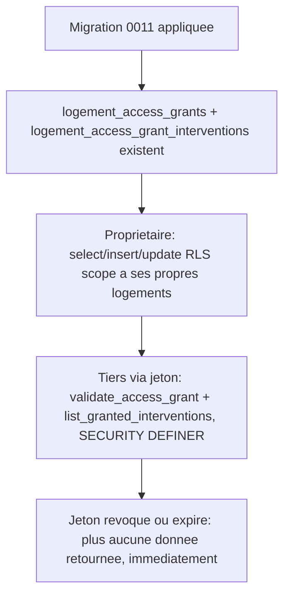

# Instruction: Schéma : octroi, portée par intervention, révocation

## Architecture projection

> Tree of the final files. ✅ create · ✏️ modify · ❌ delete

```txt
.
└── supabase/
    └── migrations/
        └── 0011_acces_carnet.sql   ✅ tables d'octroi, RLS propriétaire, fonctions de lecture pour le tiers
```

## User Journey



## Tasks to do

### `1)` Créer les tables d'octroi d'accès

> Un octroi porte une portée, une durée, et - si partielle - la liste précise des interventions concernées.

1. Créer `supabase/migrations/0011_acces_carnet.sql`.
2. `create table public.logement_access_grants (id uuid primary key default gen_random_uuid(), logement_id uuid not null references public.logements (id) on delete cascade, tiers_email text not null, token uuid not null unique default gen_random_uuid(), scope text not null check (scope in ('total', 'partiel')), expires_at timestamptz not null, revoked_at timestamptz, created_at timestamptz not null default now());`
3. `create table public.logement_access_grant_interventions (grant_id uuid not null references public.logement_access_grants (id) on delete cascade, intervention_id uuid not null references public.interventions (id) on delete cascade, primary key (grant_id, intervention_id));`

### `2)` Autoriser le propriétaire à gérer ses propres octrois

> Le propriétaire crée, consulte et révoque les accès de son propre logement ; jamais ceux d'un autre.

1. Activer RLS sur les deux tables.
2. `grant select, insert, update on public.logement_access_grants to authenticated` ; policies `select`/`insert`/`update` scopées via `exists (select 1 from public.logements l where l.id = logement_id and l.proprietaire_id = auth.uid())`.
3. `grant select, insert on public.logement_access_grant_interventions to authenticated` ; policies `select`/`insert` scopées via une jointure sur `logement_access_grants` puis `logements`.

### `3)` Créer les fonctions de lecture pour le tiers

> Le tiers non authentifié ne peut lire que ce que son jeton, valide au moment de l'appel, autorise.

1. `public.validate_access_grant(p_token uuid) returns table (logement_id uuid, adresse text, chauffage_type text, vmc_type text, scope text, valid boolean)`, `SECURITY DEFINER` : cherche l'octroi par jeton ; `valid = (revoked_at is null and expires_at > now())` ; **`adresse`/`chauffage_type`/`vmc_type` ne sont renseignés que si `scope = 'total'`**, `null` sinon (la portée partielle n'expose jamais ces champs, même via la fonction). Aucune ligne si le jeton est inconnu.
2. `public.list_granted_interventions(p_token uuid) returns table (id uuid, type_travaux text, date_intervention date, artisan_siret text, rge_verifie boolean, rge_verifie_a timestamptz)`, `SECURITY DEFINER` : revalide le jeton (mêmes conditions) ; si invalide ou inconnu, aucune ligne ; si `scope = 'total'`, toutes les interventions du logement ; si `scope = 'partiel'`, uniquement celles listées dans `logement_access_grant_interventions` pour cet octroi.
3. `grant execute on function public.validate_access_grant(uuid) to anon, authenticated;` et pareil pour `list_granted_interventions`.

## Test acceptance criteria

| Task | Acceptance criteria                                                                                                                                       |
| ---- | ------------------------------------------------------------------------------------------------------------------------------------------------------------ |
| 1    | `supabase db reset` applique la migration ; les deux tables existent, RLS activée.                                                                             |
| 2    | Un propriétaire peut créer, lire et révoquer un octroi sur son propre logement ; une tentative sur le logement d'un autre échoue (RLS refuse).                 |
| 3    | Pour un jeton valide en portée totale : `validate_access_grant` retourne l'adresse et les équipements, `list_granted_interventions` retourne toutes les interventions. Pour une portée partielle : l'adresse/les équipements sont `null`, seules les interventions sélectionnées sont listées. Pour un jeton révoqué, expiré, ou inconnu : `valid = false` (ou aucune ligne) et aucune intervention listée. |
