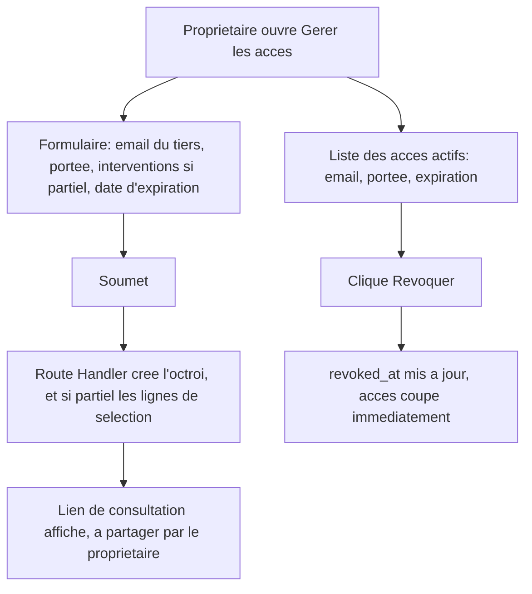

# Instruction: Gestion des accès côté propriétaire

## Architecture projection

> Tree of the final files. ✅ create · ✏️ modify · ❌ delete

```txt
.
└── apps/
    └── web/
        └── app/
            ├── (owner)/
            │   └── proprietaire/
            │       └── espace/
            │           ├── page.tsx            ✏️ lien de nav vers la gestion des accès
            │           └── acces/
            │               ├── page.tsx         ✅ shell (Server Component)
            │               ├── AccesForm.tsx     ✅ formulaire d'octroi (client)
            │               └── RevokeButton.tsx  ✅ révocation (client)
            └── api/
                └── proprietaire/
                    └── acces/
                        └── route.ts             ✅ Route Handler : crée l'octroi + ses interventions sélectionnées
```

## User Journey



## Wireframe

```txt
┌─────────────────────────────────────────────┐
│ (1) Titre "Gérer les accès"                    │
│ (2) Formulaire "Accorder un accès"             │
│   ┌───────────────────────────────────────┐  │
│   │ (3) Email du tiers                      │  │
│   │ (4) Portée : Total / Partiel             │  │
│   │ (5) Liste d'interventions à cocher       │  │
│   │      (visible seulement si Partiel)      │  │
│   │ (6) Date d'expiration                    │  │
│   │ (7) Bouton "Créer l'accès"                │  │
│   └───────────────────────────────────────┘  │
│ (8) Lien de consultation généré (après création)│
│ (9) Liste des accès actifs                     │
│   ┌───────────────────────────────────────┐  │
│   │ (10) Ligne : email · portée · expiration │  │
│   │       · bouton "Révoquer"                 │  │
│   └───────────────────────────────────────┘  │
└─────────────────────────────────────────────┘
```

1. Titre de la section.
2-7. Formulaire d'octroi : email du tiers, portée (total/partiel), sélection d'interventions (uniquement affichée si portée partielle), date d'expiration, CTA.
8. Après création, le lien `/consultation?token=...` est affiché pour que le propriétaire le partage lui-même (aucun envoi automatique).
9-10. Liste des octrois actifs (non révoqués, non expirés) avec un bouton de révocation immédiate par ligne.

## Tasks to do

### `1)` Construire l'écran de gestion des accès

> Le propriétaire crée un octroi et voit ses octrois déjà actifs.

1. Créer `apps/web/app/(owner)/proprietaire/espace/acces/page.tsx` : Server Component, vérifie la session, récupère les interventions du logement (pour la liste à cocher) et les octrois déjà actifs (non révoqués, non expirés).
2. Créer `AccesForm.tsx` (client) : `Input` email, un contrôle portée (total/partiel), les cases d'interventions (visibles si partiel), un champ date d'expiration, `Alert`/`Button` de `packages/ui`. À la soumission, appelle `POST /api/proprietaire/acces` et affiche le lien de consultation retourné.
3. Créer `RevokeButton.tsx` (client) : appelle `supabase.from('logement_access_grants').update({ revoked_at: ... }).eq('id', ...)` puis `router.refresh()`.
4. Dans `apps/web/app/(owner)/proprietaire/espace/page.tsx`, ajouter un lien de nav vers `/proprietaire/espace/acces`.

### `2)` Implémenter la Route Handler de création d'octroi

> L'octroi et sa sélection d'interventions (si partielle) sont créés de façon atomique du point de vue utilisateur.

1. Créer `apps/web/app/api/proprietaire/acces/route.ts`.
2. Valide la session propriétaire, récupère son `logement_id` (RLS restreint déjà `logements` à ses propres lignes).
3. Insère l'octroi (`tiers_email`, `scope`, `expires_at`).
4. Si `scope = 'partiel'`, insère une ligne dans `logement_access_grant_interventions` par intervention sélectionnée ; en cas d'échec, supprime l'octroi déjà créé pour ne laisser aucun octroi partiel incomplet.
5. Retourne le jeton généré (pour construire le lien `/consultation?token=...` côté client).

## Test acceptance criteria

| Task | Acceptance criteria                                                                                                                                       |
| ---- | ------------------------------------------------------------------------------------------------------------------------------------------------------------ |
| 1    | L'écran affiche le formulaire d'octroi (avec sélection d'interventions uniquement en portée partielle) et la liste des accès actifs avec un bouton de révocation. Révoquer un accès le retire immédiatement de la liste et coupe l'accès (vérifié en phase 3). |
| 2    | Créer un octroi total ou partiel retourne un jeton exploitable ; un octroi partiel dont l'insertion des interventions échoue ne laisse aucun octroi orphelin en base. |
