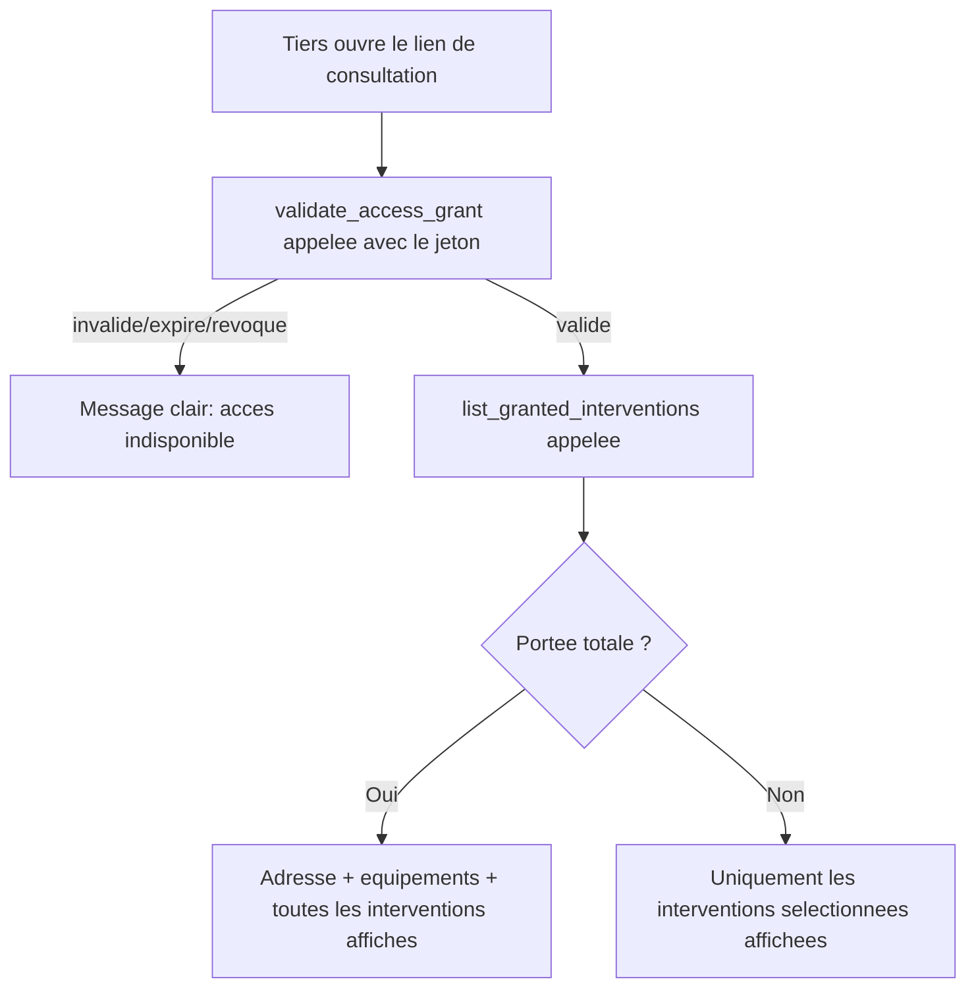

# Instruction: Consultation par le tiers via lien à jeton

## Architecture projection

> Tree of the final files. ✅ create · ✏️ modify · ❌ delete

```txt
.
└── apps/
    └── web/
        └── app/
            └── (public)/
                └── consultation/
                    └── page.tsx   ✅ lecture seule, publique, pilotée par ?token=
```

## User Journey



## Wireframe

```txt
┌─────────────────────────────────────────────┐
│ (1) Bandeau : "Consultation en lecture seule"  │
├─────────────────────────────────────────────┤
│ (2) Adresse + équipements (portée totale seule)│
│ (3) Liste des interventions autorisées         │
│   ┌───────────────────────────────────────┐  │
│   │ (4) Ligne : date · type · artisan (SIRET)│  │
│   │      · statut RGE horodaté               │  │
│   └───────────────────────────────────────┘  │
│ (5) Message si jeton invalide/expiré/révoqué   │
└─────────────────────────────────────────────┘
```

1. Bandeau : rappelle que c'est un accès tiers en lecture seule, aucune action possible.
2. Adresse/équipements : uniquement si `validate_access_grant` les retourne (portée totale).
3-4. Liste des interventions retournées par `list_granted_interventions`, jamais plus que ce que le jeton autorise.
5. Erreur : remplace tout le contenu si le jeton est invalide, expiré, ou révoqué.

## Tasks to do

### `1)` Construire la page de consultation publique

> Aucune information n'est jamais montrée sans un jeton valide au moment précis de la requête.

1. Créer `apps/web/app/(public)/consultation/page.tsx` : lit `?token=`, appelle `validate_access_grant` puis, si valide, `list_granted_interventions`, via un client Supabase non authentifié (rôle `anon`).
2. Si le jeton est absent, inconnu, expiré, ou révoqué (`valid = false` ou aucune ligne) : afficher uniquement un message clair, aucune donnée.
3. Si valide et portée totale : afficher adresse, équipements, et la liste complète des interventions.
4. Si valide et portée partielle : afficher uniquement la liste des interventions retournées, sans adresse ni équipements.

## Test acceptance criteria

| Task | Acceptance criteria                                                                                                                                       |
| ---- | ------------------------------------------------------------------------------------------------------------------------------------------------------------ |
| 1    | Un jeton valide en portée totale affiche l'adresse, les équipements et toutes les interventions du logement. Un jeton valide en portée partielle affiche uniquement les interventions sélectionnées, sans adresse ni équipements. Un jeton révoqué (y compris révoqué juste après création), expiré, ou inexistant n'affiche aucune donnée, seulement un message clair. |
