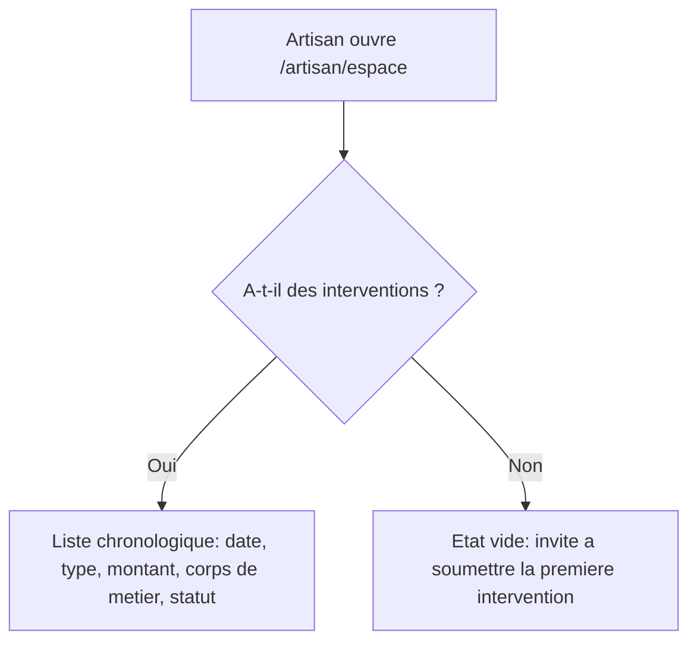

# Instruction: Liste chronologique et état vide

## Architecture projection

> Tree of the final files. ✅ create · ✏️ modify · ❌ delete

```txt
.
└── apps/
    └── web/
        └── app/
            └── (artisan)/
                └── artisan/
                    └── espace/
                        └── page.tsx   ✏️ affiche la liste des interventions ou l'état vide
```

## User Journey



## Wireframe

```txt
┌─────────────────────────────────────────────────┐
│ (1) Header: logo · email artisan · déconnexion    │
├───────────┬───────────────────────────────────────┤
│ (2) Nav   │ (3) Titre "Mes interventions"           │
│  Mes      │ (4) CTA "Soumettre une intervention"    │
│  interv.  │ (5) Liste chronologique                 │
│           │   ┌───────────────────────────────┐    │
│           │   │ (6) Ligne: date · type · montant │    │
│           │   │      · corps de métier · statut  │    │
│           │   └───────────────────────────────┘    │
│           │ (7) État vide (si aucune intervention)  │
└───────────┴───────────────────────────────────────┘
```

1. Header : identique à l'espace artisan existant.
2. Nav : entrée "Mes interventions" existante, pointe vers cette même page.
3. Titre : remplace le "Bienvenue" actuel.
4. CTA : lien existant vers le formulaire de soumission, conservé.
5. Liste : une ligne par intervention, la plus récente en premier.
6. Ligne : date, type de travaux, montant, corps de métier, statut de vérification.
7. État vide : remplace la liste quand aucune intervention n'existe ; le CTA (région 4) sert d'invite à soumettre la première.

## Tasks to do

### `1)` Récupérer et afficher la liste chronologique

> L'artisan voit ses interventions passées, triées de la plus récente à la plus ancienne.

1. Dans `apps/web/app/(artisan)/artisan/espace/page.tsx`, après la vérification de session, requêter `interventions` (RLS restreint déjà aux lignes de l'artisan connecté) triées par `date_intervention` décroissant.
2. Afficher chaque intervention : date, type de travaux, montant formaté en euros, corps de métier, statut de vérification (libellé lisible, ex. "En attente de vérification" pour `en_attente_verification`).
3. Remplacer le titre "Bienvenue" par "Mes interventions", en conservant le CTA "Soumettre une intervention".

### `2)` Gérer l'état vide

> Un artisan sans intervention voit une invite claire, jamais une liste vide silencieuse ni une erreur.

1. Quand la requête ne retourne aucune ligne, afficher un message invitant à soumettre la première intervention à la place de la liste.

## Test acceptance criteria

| Task | Acceptance criteria                                                                                          |
| ---- | -------------------------------------------------------------------------------------------------------------- |
| 1    | Un artisan avec des interventions voit, en ouvrant `/artisan/espace`, la liste chronologique (plus récente en premier) avec date, type de travaux, montant, corps de métier et statut pour chacune. |
| 2    | Un artisan sans intervention voit, en ouvrant `/artisan/espace`, un message d'invite à soumettre sa première intervention plutôt qu'une liste vide ou une erreur. |
