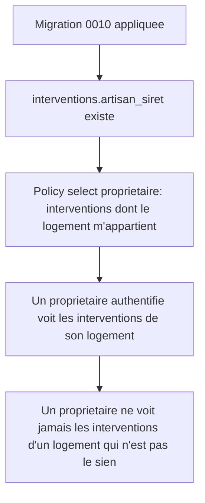

# Instruction: Schéma : accès propriétaire aux interventions

## Architecture projection

> Tree of the final files. ✅ create · ✏️ modify · ❌ delete

```txt
.
├── supabase/
│   └── migrations/
│       └── 0010_interventions_select_owner.sql   ✅ colonne artisan_siret, policy select propriétaire
└── apps/
    └── web/
        └── app/
            └── api/
                └── artisan/
                    └── interventions/
                        └── route.ts               ✏️ enregistre artisan_siret à la soumission
```

## User Journey



## Tasks to do

### `1)` Ajouter le SIRET de l'artisan à l'intervention

> Le propriétaire voit qui est intervenu sans avoir besoin d'un accès à la table `artisans`.

1. Créer `supabase/migrations/0010_interventions_select_owner.sql`.
2. `alter table public.interventions add column artisan_siret text;`
3. Dans `apps/web/app/api/artisan/interventions/route.ts`, inclure `artisan_siret: artisan?.siret ?? null` dans l'insert (le SIRET est déjà récupéré pour la vérification RGE).

### `2)` Autoriser le propriétaire à consulter les interventions de son logement

> Aucune policy `select` existante ne couvre le propriétaire ; seul l'artisan auteur peut aujourd'hui lire une intervention.

1. `create policy "interventions_select_owner" on public.interventions for select to authenticated using (exists (select 1 from public.logements l where l.id = interventions.logement_id and l.proprietaire_id = auth.uid()));`

## Test acceptance criteria

| Task | Acceptance criteria                                                                                                                                       |
| ---- | ------------------------------------------------------------------------------------------------------------------------------------------------------------ |
| 1    | Une nouvelle intervention soumise porte le SIRET de l'artisan qui l'a soumise.                                                                                 |
| 2    | Un propriétaire authentifié voit les interventions rattachées à son logement ; il ne voit aucune intervention rattachée au logement d'un autre propriétaire.  |
