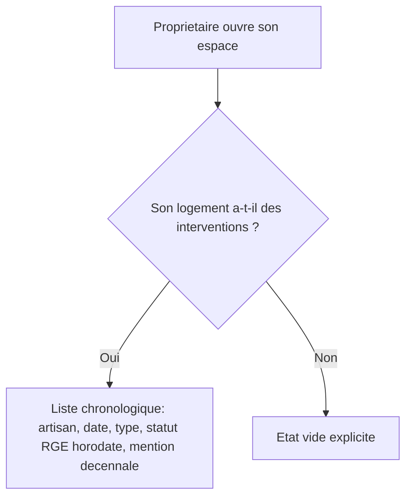

# Instruction: Vue historique dans l'espace propriétaire

## Architecture projection

> Tree of the final files. ✅ create · ✏️ modify · ❌ delete

```txt
.
└── apps/
    └── web/
        └── app/
            └── (owner)/
                └── proprietaire/
                    └── espace/
                        └── page.tsx   ✏️ ajoute la liste chronologique des interventions
```

## User Journey



## Wireframe

```txt
┌─────────────────────────────────────────────┐
│ (1) Header: logo · email · déconnexion        │
├─────────────────────────────────────────────┤
│ (2) Mon logement (adresse + équipements)       │
│ (3) Titre "Historique des interventions"       │
│ (4) Liste chronologique                        │
│   ┌───────────────────────────────────────┐  │
│   │ (5) Ligne: date · type · artisan (SIRET) │  │
│   │      · statut RGE (horodaté) · décennale │  │
│   └───────────────────────────────────────┘  │
│ (6) État vide (si aucune intervention)         │
└─────────────────────────────────────────────┘
```

1-2. Contenu déjà existant (US-07).
3. Titre de la nouvelle section.
4-5. Liste triée de la plus récente à la plus ancienne ; chaque ligne : date, type de travaux, SIRET de l'artisan, statut RGE avec son horodatage, mention décennale déclarative.
6. État vide : remplace la liste quand le logement n'a aucune intervention.

## Tasks to do

### `1)` Récupérer et afficher l'historique des interventions

> Le propriétaire voit chaque intervention de son logement, la plus récente en premier.

1. Dans `apps/web/app/(owner)/proprietaire/espace/page.tsx`, quand un logement est lié, requêter `interventions` (RLS restreint déjà aux interventions du logement du propriétaire connecté) triées par `date_intervention` décroissant : `type_travaux`, `date_intervention`, `artisan_siret`, `rge_verifie`, `rge_verifie_a`.
2. Afficher chaque ligne : date, type de travaux, SIRET de l'artisan, badge RGE (vérifié/non vérifié) avec la date de vérification, mention "Attestation décennale : déclarative, non vérifiée par une source tierce".

### `2)` Gérer l'état vide

> Un logement sans intervention affiche une invite claire, jamais une liste vide silencieuse ni une erreur.

1. Quand la requête ne retourne aucune ligne, afficher un message explicite ("Aucune intervention enregistrée pour ce logement pour l'instant.") à la place de la liste.

## Test acceptance criteria

| Task | Acceptance criteria                                                                                                                                       |
| ---- | ------------------------------------------------------------------------------------------------------------------------------------------------------------ |
| 1    | Un propriétaire dont le logement a reçu plusieurs interventions les voit toutes, triées de la plus récente à la plus ancienne, avec artisan (SIRET), date, type de travaux, statut RGE horodaté et mention décennale. |
| 2    | Un propriétaire dont le logement n'a aucune intervention voit un état vide explicite plutôt qu'une liste vide ou une erreur.                                   |
