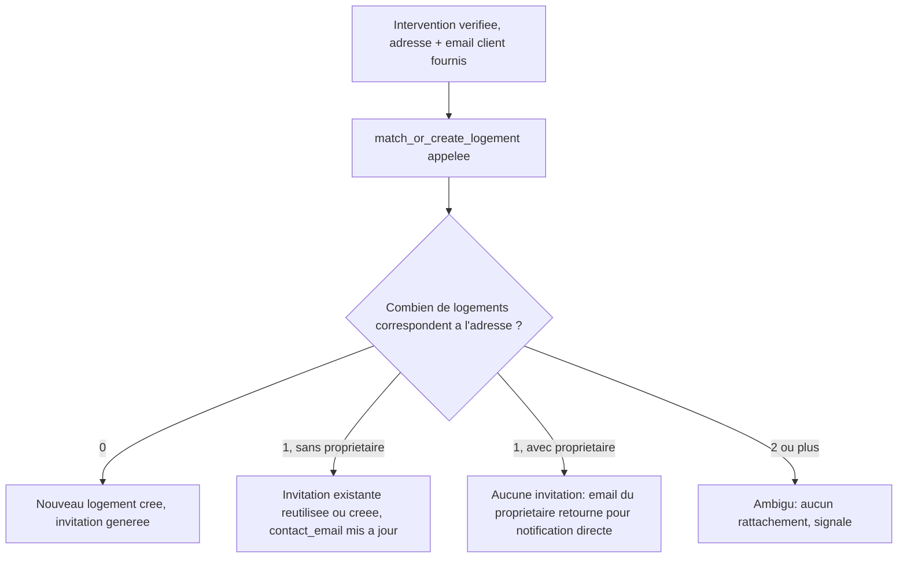

# Instruction: Schéma : adresse/email client, rattachement, fonction de matching

## Architecture projection

> Tree of the final files. ✅ create · ✏️ modify · ❌ delete

```txt
.
└── supabase/
    └── migrations/
        └── 0008_rattachement_logement.sql   ✅ colonnes interventions/logements, fonction match_or_create_logement
```

## User Journey



## Tasks to do

### `1)` Ajouter les colonnes nécessaires au rattachement

> Chaque intervention porte l'adresse et l'email fournis par l'artisan, le logement rattaché (ou l'absence signalée).

1. Créer `supabase/migrations/0008_rattachement_logement.sql`.
2. `alter table public.interventions add column adresse_logement text not null, add column email_client text not null, add column logement_id uuid references public.logements (id), add column rattachement_ambigu boolean not null default false;`
3. `alter table public.logements add column contact_email text;`

### `2)` Créer la fonction de matching et de création

> Un artisan peut faire rechercher/créer un logement par adresse sans jamais avoir un accès direct en lecture à tous les logements.

1. `public.match_or_create_logement(p_adresse text, p_contact_email text) returns table (logement_id uuid, created boolean, ambiguous boolean, invitation_token uuid, notify_email text)`, `SECURITY DEFINER`.
2. Recherche les logements dont l'adresse normalisée (`trim`, `lower`) correspond exactement à `p_adresse` normalisée.
3. Zéro correspondance : crée un nouveau logement (`adresse = p_adresse`, `contact_email = p_contact_email`), crée une invitation (`expires_at = now() + interval '30 days'`), retourne `created = true`, `invitation_token`, `notify_email = p_contact_email`, `ambiguous = false`.
4. Une correspondance, `proprietaire_id` nul : met à jour `contact_email`, réutilise une invitation active existante ou en crée une nouvelle, retourne `created = false`, `invitation_token`, `notify_email = p_contact_email`, `ambiguous = false`.
5. Une correspondance, `proprietaire_id` renseigné : retourne `created = false`, `invitation_token = null`, `notify_email` = l'email du propriétaire (`auth.users.email`), `ambiguous = false`.
6. Deux correspondances ou plus : retourne `ambiguous = true`, `logement_id = null`, `created = false`, `invitation_token = null`, `notify_email = null`, sans rien modifier.
7. `grant execute on function public.match_or_create_logement(text, text) to authenticated`.

## Test acceptance criteria

| Task | Acceptance criteria                                                                                                                                       |
| ---- | ------------------------------------------------------------------------------------------------------------------------------------------------------------ |
| 1    | `supabase db reset` applique la migration ; les nouvelles colonnes existent sans casser les données déjà présentes.                                          |
| 2    | Pour une adresse inconnue : un nouveau logement et une invitation valide sont créés. Pour une adresse d'un logement non réclamé : l'invitation existante est réutilisée ou renouvelée, `contact_email` mis à jour. Pour une adresse d'un logement déjà réclamé : aucune invitation créée, l'email du propriétaire est retourné. Pour une adresse correspondant à deux logements : `ambiguous = true`, aucune modification. |
