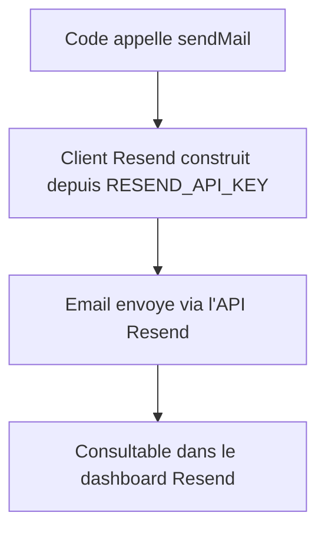

# Instruction: Envoi d'email transactionnel (`packages/notifications`)

## Architecture projection

> Tree of the final files. ✅ create · ✏️ modify · ❌ delete

```txt
.
├── packages/
│   └── notifications/
│       ├── package.json         ✅ nouveau package (resend)
│       ├── tsconfig.json        ✅
│       └── src/
│           ├── index.ts         ✅ export public
│           └── mailer.ts        ✅ sendMail(to, subject, html) via l'API Resend
└── .env.example                 ✏️ RESEND_API_KEY, RESEND_FROM_EMAIL
```

## User Journey



## Tasks to do

### `1)` Créer le package `packages/notifications`

> Un point unique d'envoi d'email.

1. Créer `packages/notifications/package.json` (nom `@alpha-cil/notifications`, dépendance `resend`), `packages/notifications/tsconfig.json` (même forme que `packages/db`).
2. Créer `packages/notifications/src/mailer.ts` exportant `sendMail(to: string, subject: string, html: string): Promise<void>` : construit un client `Resend` depuis `RESEND_API_KEY`, envoie depuis `RESEND_FROM_EMAIL`.
3. Créer `packages/notifications/src/index.ts` exportant `sendMail`.

### `2)` Documenter les variables d'environnement

> Un développeur sait quoi renseigner sans deviner.

1. Documenter dans `.env.example` : `RESEND_API_KEY`, `RESEND_FROM_EMAIL`, sans valeur réelle.

## Test acceptance criteria

| Task | Acceptance criteria                                                                                                              |
| ---- | --------------------------------------------------------------------------------------------------------------------------------- |
| 1    | `sendMail` envoie réellement un email via l'API Resend quand `RESEND_API_KEY`/`RESEND_FROM_EMAIL` sont renseignées ; une erreur Resend est propagée avec un message clair. |
| 2    | `.env.example` liste les deux variables sans valeur réelle.                                                                        |
