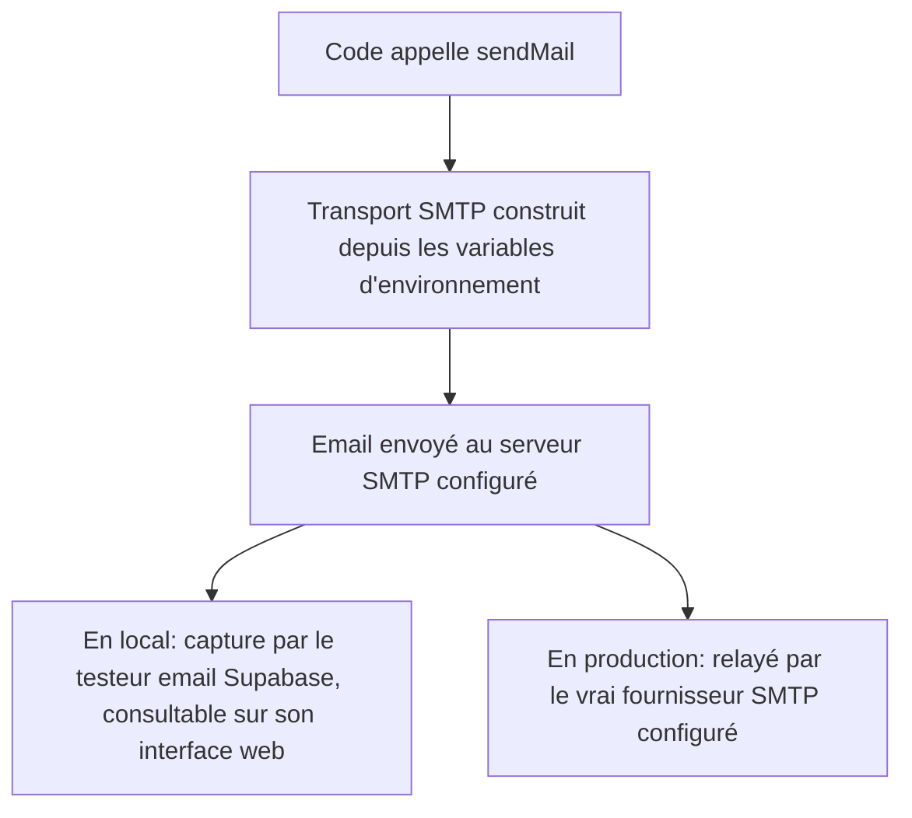

# Instruction: Envoi d'email transactionnel (`packages/notifications`)

## Architecture projection

> Tree of the final files. ✅ create · ✏️ modify · ❌ delete

```txt
.
├── packages/
│   └── notifications/
│       ├── package.json         ✅ nouveau package (nodemailer)
│       ├── tsconfig.json        ✅
│       └── src/
│           ├── index.ts         ✅ export public
│           └── mailer.ts        ✅ sendMail(to, subject, html) via SMTP configurable
├── supabase/
│   └── config.toml              ✏️ expose le port SMTP du testeur email local
└── .env.example                 ✏️ variables SMTP_*
```

## User Journey



## Tasks to do

### `1)` Créer le package `packages/notifications`

> Un point unique d'envoi d'email, indépendant du fournisseur.

1. Créer `packages/notifications/package.json` (nom `@alpha-cil/notifications`, dépendance `nodemailer`), `packages/notifications/tsconfig.json` (même forme que `packages/db`).
2. Créer `packages/notifications/src/mailer.ts` exportant `sendMail(to: string, subject: string, html: string): Promise<void>` : construit un transport `nodemailer` à partir de `SMTP_HOST`, `SMTP_PORT`, `SMTP_SECURE`, `SMTP_USER`/`SMTP_PASS` (optionnels), `SMTP_FROM`.
3. Créer `packages/notifications/src/index.ts` exportant `sendMail`.

### `2)` Exposer le testeur email local pour le développement

> Les emails envoyés en local sont réellement capturés et consultables, sans dépendre d'un vrai fournisseur.

1. Dans `supabase/config.toml`, section `[local_smtp]` : décommenter `smtp_port = 54325`.
2. Documenter dans `.env.example` : `SMTP_HOST`, `SMTP_PORT`, `SMTP_SECURE`, `SMTP_USER`, `SMTP_PASS`, `SMTP_FROM`, sans valeur réelle.

## Test acceptance criteria

| Task | Acceptance criteria                                                                                                              |
| ---- | --------------------------------------------------------------------------------------------------------------------------------- |
| 1    | `sendMail` envoie réellement un email via le SMTP configuré ; testé en local, il apparaît dans le testeur email Supabase.          |
| 2    | Après `supabase db reset`/`supabase start`, le port SMTP local est actif et accepte une connexion ; `.env.example` liste toutes les variables sans valeur secrète. |
