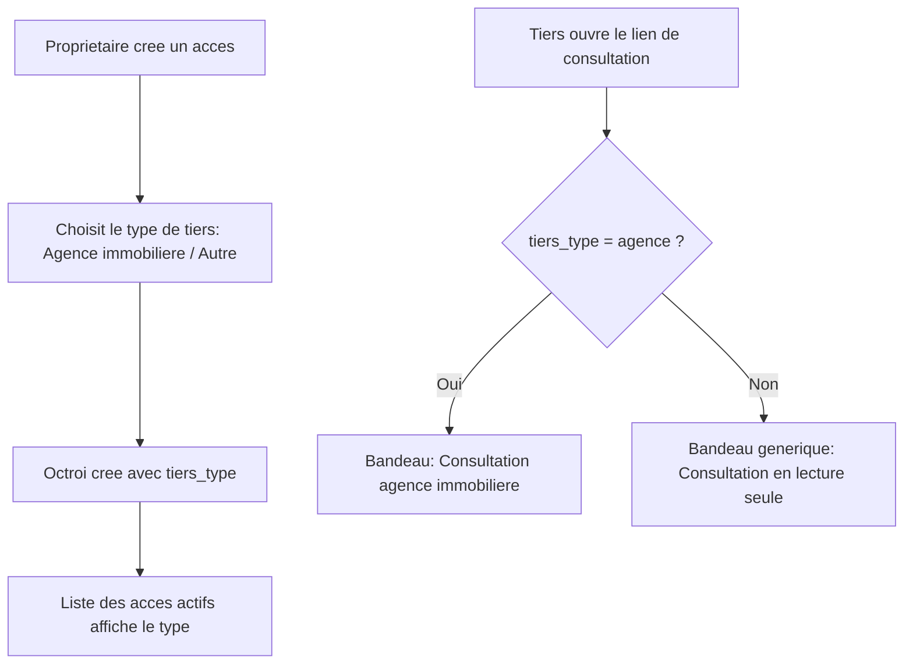

# Instruction: Type de tiers sur l'octroi, la liste, et la consultation

## Architecture projection

> Tree of the final files. ✅ create · ✏️ modify · ❌ delete

```txt
.
├── supabase/
│   └── migrations/
│       └── 0013_tiers_type.sql                       ✅ colonne tiers_type sur logement_access_grants
└── apps/
    └── web/
        └── app/
            ├── api/
            │   └── proprietaire/
            │       └── acces/
            │           └── route.ts                   ✏️ accepte et enregistre tiersType
            ├── (owner)/
            │   └── proprietaire/
            │       └── espace/
            │           └── acces/
            │               ├── AccesForm.tsx           ✏️ sélecteur type de tiers
            │               └── page.tsx                ✏️ affiche le type dans la liste des accès actifs
            └── (public)/
                └── consultation/
                    └── page.tsx                        ✏️ bandeau adapté si le tiers est une agence
```

## User Journey



## Tasks to do

### `1)` Ajouter la colonne `tiers_type`

> Chaque octroi porte le type de tiers choisi par le propriétaire, sans incidence sur la portée ni la sécurité de l'accès.

1. Créer `supabase/migrations/0013_tiers_type.sql`.
2. `alter table public.logement_access_grants add column tiers_type text not null default 'autre' check (tiers_type in ('agence', 'autre'));`
3. Mettre à jour `validate_access_grant` pour retourner aussi `tiers_type` (`create or replace function`).

### `2)` Ajouter le sélecteur au formulaire d'octroi

> Le propriétaire choisit le type de tiers en créant l'accès.

1. Dans `AccesForm.tsx`, ajouter un contrôle "Type de tiers" (Agence immobilière / Autre), envoyé dans le corps de la requête `POST /api/proprietaire/acces`.
2. Dans `apps/web/app/api/proprietaire/acces/route.ts`, valider et enregistrer `tiers_type` dans l'insert.

### `3)` Afficher le type dans la liste des accès actifs

> Le propriétaire voit, pour chaque accès, à qui il l'a accordé.

1. Dans `apps/web/app/(owner)/proprietaire/espace/acces/page.tsx`, afficher le type ("Agence immobilière" ou "Autre") à côté de la portée existante.

### `4)` Adapter la page de consultation

> Le bandeau reflète le type de tiers, sans changer les données affichées ni les actions disponibles.

1. Dans `apps/web/app/(public)/consultation/page.tsx`, afficher "Consultation agence immobilière — lecture seule" si `tiers_type = 'agence'`, sinon le bandeau générique existant.

## Test acceptance criteria

| Task | Acceptance criteria                                                                                                                                       |
| ---- | ------------------------------------------------------------------------------------------------------------------------------------------------------------ |
| 1    | `supabase db reset` applique la migration ; les octrois déjà existants (créés avant cette migration) valent `tiers_type = 'autre'` sans erreur.                |
| 2    | Créer un octroi avec le type "Agence immobilière" l'enregistre correctement.                                                                                    |
| 3    | La liste des accès actifs affiche le type de chaque octroi.                                                                                                     |
| 4    | La page de consultation affiche le bandeau "agence" pour un octroi de ce type, le bandeau générique sinon ; aucune autre différence de contenu ou d'action.    |
