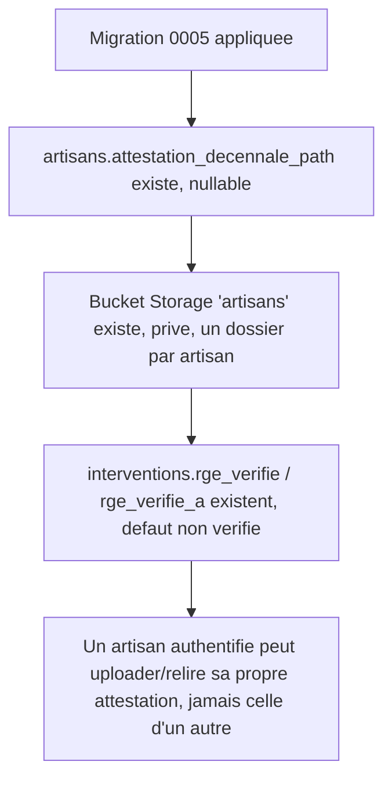

# Instruction: Schéma : attestation décennale & statut RGE

## Architecture projection

> Tree of the final files. ✅ create · ✏️ modify · ❌ delete

```txt
.
└── supabase/
    └── migrations/
        └── 0005_verification_rge_decennale.sql   ✅ colonnes décennale sur artisans, colonnes RGE sur interventions, bucket artisans
```

## User Journey



## Tasks to do

### `1)` Ajouter l'attestation décennale au profil artisan

> Un artisan peut avoir une attestation décennale associée à son compte, indépendamment de ses interventions.

1. Créer `supabase/migrations/0005_verification_rge_decennale.sql`.
2. `alter table public.artisans add column attestation_decennale_path text, add column attestation_decennale_uploaded_at timestamptz;` (nullable : un artisan existant n'en a pas encore).

### `2)` Créer le bucket de stockage des documents de profil artisan

> L'attestation décennale n'est lisible que par l'artisan qui l'a soumise.

1. `insert into storage.buckets (id, name, public, file_size_limit, allowed_mime_types) values ('artisans', 'artisans', false, 10485760, array['application/pdf']);`
2. Policies sur `storage.objects` (`insert`, `select`, `update`, toutes `to authenticated`) : `bucket_id = 'artisans' and (storage.foldername(name))[1] = auth.uid()::text`.
3. `grant select, insert, update on storage.objects to authenticated` (le insert/select générique existe déjà depuis la migration 0003 ; ajouter `update` pour permettre le remplacement d'une attestation).

### `3)` Ajouter le statut RGE aux interventions

> Chaque intervention porte le résultat et l'horodatage de sa vérification RGE.

1. `alter table public.interventions add column rge_verifie boolean not null default false, add column rge_verifie_a timestamptz;`

## Test acceptance criteria

| Task | Acceptance criteria                                                                                                                                     |
| ---- | ------------------------------------------------------------------------------------------------------------------------------------------------------------ |
| 1    | `supabase db reset` applique la migration ; `artisans` porte les deux nouvelles colonnes, nullable, sans casser les lignes existantes.                        |
| 2    | Le bucket `artisans` existe, privé, PDF uniquement ; un artisan authentifié peut uploader et relire un fichier dans son propre dossier, mais pas dans celui d'un autre. |
| 3    | `interventions` porte `rge_verifie` (faux par défaut) et `rge_verifie_a`, sans casser les interventions déjà insérées par US-02.                              |
