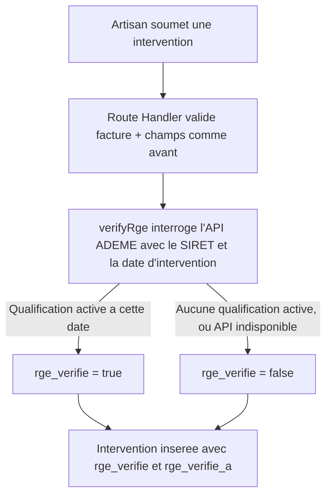

# Instruction: Client ADEME et vérification à la soumission

## Architecture projection

> Tree of the final files. ✅ create · ✏️ modify · ❌ delete

```txt
.
├── packages/
│   └── intervention/
│       ├── package.json           ✅ nouveau package
│       ├── tsconfig.json          ✅
│       └── src/
│           ├── index.ts           ✅ export public
│           └── ademe.ts           ✅ verifyRge(siret, dateIntervention)
└── apps/
    └── web/
        ├── package.json                              ✏️ dépendance @alpha-cil/intervention
        └── app/
            └── api/
                └── artisan/
                    └── interventions/
                        └── route.ts                   ✏️ appelle verifyRge, enregistre rge_verifie/rge_verifie_a
```

## User Journey



## Tasks to do

### `1)` Créer le package `packages/intervention`

> Le seul point du système autorisé à parler à l'API ADEME, réutilisable par les futures stories (US-04).

1. Créer `packages/intervention/package.json` (nom `@alpha-cil/intervention`, `main`/`types` vers `src/index.ts`), `packages/intervention/tsconfig.json` (même forme que `packages/db`).
2. Créer `packages/intervention/src/ademe.ts` exportant `verifyRge(siret: string, date: string): Promise<boolean>` :
   - Interroge `https://data.ademe.fr/data-fair/api/v1/datasets/liste-des-entreprises-rge-2/lines?qs=siret:${siret}`.
   - Retourne `true` si au moins un résultat a `lien_date_debut <= date <= lien_date_fin`, `false` sinon.
   - Toute erreur réseau ou réponse invalide est interceptée et traitée comme `false` (jamais propagée en exception).
3. Créer `packages/intervention/src/index.ts` exportant `verifyRge`.

### `2)` Appeler la vérification à la soumission d'une intervention

> Chaque intervention soumise porte désormais un statut RGE vérifié et horodaté.

1. Ajouter `@alpha-cil/intervention` aux dépendances de `apps/web/package.json`.
2. Dans `apps/web/app/api/artisan/interventions/route.ts`, après la validation existante (facture PDF, champs requis) et avant l'insertion : récupérer le `siret` de l'artisan connecté (table `artisans`), appeler `verifyRge(siret, dateIntervention)`.
3. Insérer l'intervention avec `rge_verifie` (résultat de l'appel) et `rge_verifie_a` (horodatage de l'appel, `new Date().toISOString()`), en plus des champs déjà gérés par US-02.

## Test acceptance criteria

| Task | Acceptance criteria                                                                                                                                       |
| ---- | ------------------------------------------------------------------------------------------------------------------------------------------------------------ |
| 1    | `verifyRge` retourne `true` pour un SIRET et une date réellement couverts par une qualification RGE active (testé contre l'API réelle), `false` pour un SIRET inconnu, et `false` (jamais d'exception) si l'API est injoignable. |
| 2    | Une intervention soumise par un artisan dont le SIRET est RGE-actif à la date de l'intervention est enregistrée avec `rge_verifie = true` et un `rge_verifie_a` renseigné ; sinon `rge_verifie = false`. La soumission réussit dans les deux cas. |
