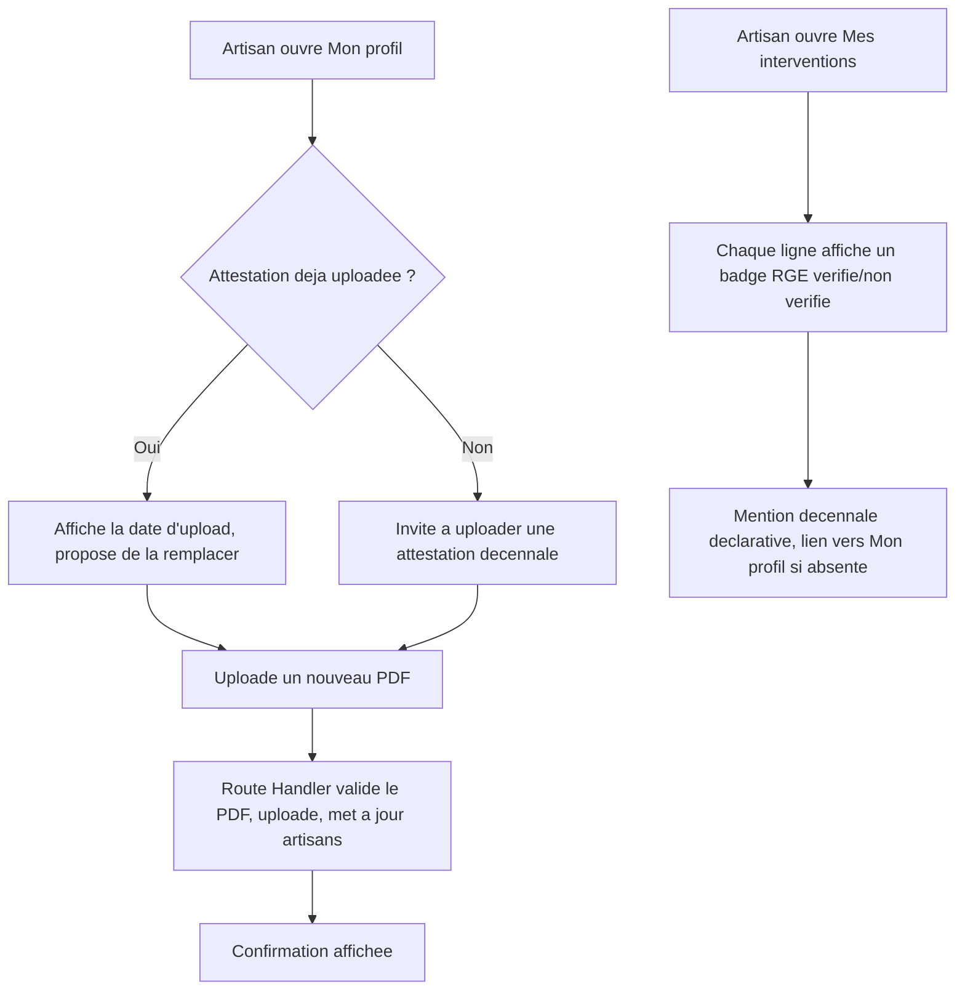

# Instruction: Profil artisan (décennale) et affichage du statut

## Architecture projection

> Tree of the final files. ✅ create · ✏️ modify · ❌ delete

```txt
.
└── apps/
    └── web/
        └── app/
            ├── (artisan)/
            │   └── artisan/
            │       └── espace/
            │           ├── page.tsx                  ✏️ nav "Mon profil" + badge RGE et statut décennale par intervention
            │           └── profil/
            │               ├── page.tsx              ✅ shell (Server Component, vérifie la session)
            │               └── DecennaleForm.tsx      ✅ upload/remplacement de l'attestation
            └── api/
                └── artisan/
                    └── decennale/
                        └── route.ts                   ✅ Route Handler d'upload
```

## User Journey



## Wireframe

```txt
┌─────────────────────────────────────────────┐
│ (1) Header: logo · email · déconnexion        │
├───────────┬───────────────────────────────────┤
│ (2) Nav   │ (3) Titre "Mon profil"              │
│  Mes      │ (4) Attestation décennale actuelle   │
│  interv.  │      (nom du fichier et date, ou     │
│  Mon      │      "aucune attestation")           │
│  profil   │ (5) Champ upload (PDF)               │
│           │ (6) Bouton "Enregistrer"              │
└───────────┴───────────────────────────────────┘
```

1. Header : identique aux autres écrans de l'espace artisan.
2. Nav : ajoute l'entrée "Mon profil" à côté de "Mes interventions".
3. Titre de section.
4. État actuel : nom du fichier et date d'upload si une attestation existe, sinon un message explicite.
5. Champ fichier, PDF uniquement.
6. CTA : uploade et remplace l'attestation existante.

## Tasks to do

### `1)` Construire l'écran "Mon profil"

> Un artisan voit et peut renseigner ou remplacer son attestation décennale.

1. Créer `apps/web/app/(artisan)/artisan/espace/profil/page.tsx` : Server Component qui vérifie la session (redirige vers `/artisan/connexion` sinon), lit `attestation_decennale_path`/`attestation_decennale_uploaded_at` de l'artisan connecté.
2. Créer `apps/web/app/(artisan)/artisan/espace/profil/DecennaleForm.tsx` (client) : affiche l'état actuel (région 4), le champ upload (région 5) et le CTA (région 6), avec `Input`/`Button`/`Alert` de `packages/ui`.
3. Dans `apps/web/app/(artisan)/artisan/espace/page.tsx`, ajouter le lien de nav vers `/artisan/espace/profil` (région 2).

### `2)` Implémenter l'upload de l'attestation décennale

> Le fichier remplace toujours l'attestation précédente ; aucune attestation partielle ou orpheline.

1. Créer `apps/web/app/api/artisan/decennale/route.ts`, acceptant un `multipart/form-data` avec un champ `attestation`.
2. Vérifier la session artisan ; vérifier que le fichier est bien `application/pdf`, sinon erreur typée sans upload.
3. Uploader vers le bucket `artisans`, sous `<artisan_id>/decennale.pdf` (upsert : remplace l'existant).
4. Mettre à jour `artisans.attestation_decennale_path` et `attestation_decennale_uploaded_at` pour l'artisan connecté.

### `3)` Afficher le statut RGE et décennale sur l'historique

> L'artisan voit, pour chaque intervention, si son statut RGE était vérifié à cette date, et l'état de son attestation décennale.

1. Dans `apps/web/app/(artisan)/artisan/espace/page.tsx`, ajouter à chaque ligne d'intervention un badge "RGE vérifié" ou "RGE non vérifié" selon `rge_verifie`.
2. Ajouter, hors de la liste (une seule fois), une ligne "Attestation décennale : déclarative, non vérifiée par une source tierce" avec la date d'upload si elle existe, ou un lien vers "Mon profil" si aucune n'est renseignée.

## Test acceptance criteria

| Task | Acceptance criteria                                                                                                                                       |
| ---- | ------------------------------------------------------------------------------------------------------------------------------------------------------------ |
| 1    | La page `/artisan/espace/profil` affiche l'état actuel de l'attestation (ou son absence) et le formulaire d'upload ; le lien de nav y mène depuis `/artisan/espace`. |
| 2    | Un upload PDF valide remplace l'attestation existante et met à jour la date ; un fichier non-PDF est rejeté sans modifier le profil.                          |
| 3    | Chaque intervention de la liste affiche son statut RGE (vérifié/non vérifié) ; la mention décennale déclarative apparaît une fois, avec la date si renseignée, ou une invite à la renseigner sinon. |
