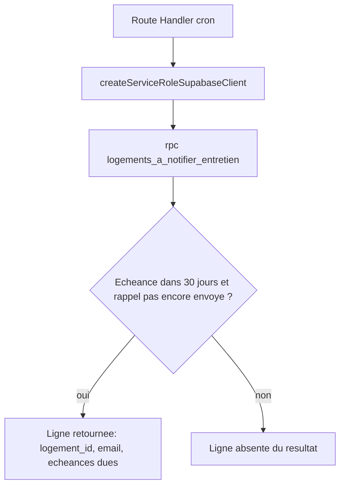

# Instruction: Schéma : dates d'entretien + accès système restreint

## Architecture projection

> Tree of the final files. ✅ create · ✏️ modify · ❌ delete

```txt
.
├── supabase/
│   └── migrations/
│       └── 0016_rappels_entretien.sql   ✅ colonnes dates/rappel + fonction SECURITY DEFINER restreinte
└── packages/
    └── db/
        └── client.ts                     ✏️ createServiceRoleSupabaseClient()
```

## User Journey



## Tasks to do

### `1)` Étendre `logements` pour porter la date d'entretien et l'état d'envoi

> Chaque équipement concerné a sa propre date de référence et son propre indicateur de rappel déjà envoyé, pour ne jamais notifier deux fois la même échéance.

1. `alter table public.logements add column derniere_verif_chauffage date, add column rappel_chauffage_envoye_a timestamptz, add column derniere_verif_vmc date, add column rappel_vmc_envoye_a timestamptz;`

### `2)` Fonction de lecture des rappels dus, accessible au seul rôle système

> Le calcul d'échéance a besoin de l'email du propriétaire (`auth.users`, hors schéma exposé par l'API), donc d'une fonction `SECURITY DEFINER` — mais son exécution ne doit jamais fuiter vers un utilisateur authentifié normal.

1. Créer `public.logements_a_notifier_entretien()` (`security definer`, `returns table (logement_id uuid, proprietaire_email text, chauffage_du boolean, chauffage_echeance date, vmc_du boolean, vmc_echeance date)`) : sélectionne les logements où (`chauffage_type in ('gaz','bois')` et `derniere_verif_chauffage` non nul et `rappel_chauffage_envoye_a` nul et `derniere_verif_chauffage + interval '1 year' <= now() + interval '30 days'`) et/ou la même logique pour `vmc_type in ('simple_flux','double_flux')` / `derniere_verif_vmc`. Ne retourne que les logements ayant au moins une échéance due. Joint `auth.users` pour l'email du `proprietaire_id`.
2. `revoke execute on function public.logements_a_notifier_entretien() from public;` puis `grant execute on function public.logements_a_notifier_entretien() to service_role;` — empêche tout utilisateur `anon`/`authenticated` de l'appeler directement (Postgres accorde `EXECUTE` à `PUBLIC` par défaut à la création).

### `3)` Client Supabase à rôle de service

> Le job de rappels agit pour le système entier, jamais pour un utilisateur — il lui faut un client qui contourne RLS, jamais le client à cookies de session.

1. Dans `packages/db/client.ts`, ajouter `createServiceRoleSupabaseClient()` : `createClient(requireEnv("SUPABASE_URL"), requireEnv("SUPABASE_SERVICE_ROLE_KEY"), { auth: { autoRefreshToken: false, persistSession: false } })` (import direct `createClient` de `@supabase/supabase-js`, sans cookies — aucune session utilisateur n'est en jeu).

## Test acceptance criteria

| Task | Acceptance criteria                                                                                                                                       |
| ---- | ------------------------------------------------------------------------------------------------------------------------------------------------------------ |
| 1    | Les quatre colonnes existent et sont modifiables par le propriétaire via la policy `logements_update_owner` déjà en place (aucune régression, aucune nouvelle policy nécessaire). |
| 2    | Appelée avec la clé `service_role` (via `psql`/le client de service), la fonction retourne un logement dont l'échéance chauffage ou VMC tombe dans les 30 jours et dont le rappel n'a pas encore été envoyé ; elle omet un logement dont l'échéance est lointaine, déjà notifiée, ou dont l'équipement n'est pas concerné. Appelée avec une clé `anon` ou `authenticated`, l'appel est refusé (`permission denied`). |
| 3    | `createServiceRoleSupabaseClient()` s'authentifie en `service_role` (vérifiable via une requête qui ne serait autorisée qu'à ce rôle, par exemple l'appel RPC ci-dessus). |
