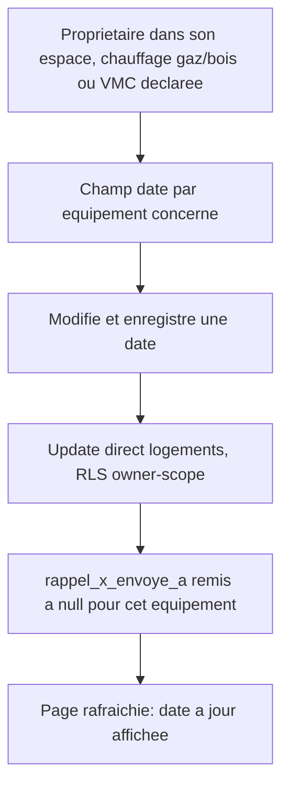

# Instruction: Saisie de la date de dernier entretien

## Architecture projection

> Tree of the final files. ✅ create · ✏️ modify · ❌ delete

```txt
.
└── apps/
    └── web/
        └── app/
            └── (owner)/
                └── proprietaire/
                    └── espace/
                        ├── page.tsx           ✏️ affiche EntretienForm quand un équipement concerné est déclaré
                        └── EntretienForm.tsx  ✅ saisie/mise à jour des dates de dernier entretien (client)
```

## User Journey



## Wireframe

```txt
┌─────────────────────────────────────────────┐
│ Chauffage : Gaz                               │
│ VMC : VMC simple flux                         │
│ (1) Dernier entretien de la chaudière          │
│     [ 2025-03-10 ]  [ Enregistrer ]            │
│ (2) Dernier entretien de la VMC                │
│     [ __________ ]  [ Enregistrer ]            │
└─────────────────────────────────────────────┘
```

1. Champ date pour l'équipement chauffage, visible seulement si `chauffage_type` est `gaz` ou `bois` ; libellé "chaudière" pour `gaz`, "ramonage" pour `bois`.
2. Champ date pour la VMC, visible seulement si `vmc_type` est `simple_flux` ou `double_flux`.

## Tasks to do

### `1)` Construire le formulaire de saisie des dates d'entretien

> Chaque champ n'apparaît que pour un équipement qui a effectivement besoin d'un entretien programmé, jamais pour un chauffage électrique ou une fiche sans VMC.

1. Créer `EntretienForm.tsx` (client), props `logementId`, `chauffageType`, `vmcType`, `derniereVerifChauffage`, `derniereVerifVmc`. Pour chaque équipement éligible (`chauffageType` en `gaz`/`bois`, `vmcType` en `simple_flux`/`double_flux`), un champ date pré-rempli et un bouton d'enregistrement indépendant.
2. À la soumission d'un champ, `createBrowserSupabaseClient().from("logements").update(...)` sur `logementId` : met à jour la colonne de date concernée ET remet sa colonne `rappel_*_envoye_a` à `null` dans le même appel (nouvelle échéance, nouveau cycle de notification). `router.refresh()` sur succès.
3. Dans `page.tsx`, rendre `EntretienForm` avec les valeurs actuelles dès que `chauffage_type`/`vmc_type` sont éligibles (ajouter `derniere_verif_chauffage`, `derniere_verif_vmc` au `select`).

## Test acceptance criteria

| Task | Acceptance criteria                                                                                                                                       |
| ---- | ------------------------------------------------------------------------------------------------------------------------------------------------------------ |
| 1    | Avec un chauffage gaz et une VMC simple flux, les deux champs de date apparaissent ; avec un chauffage électrique et aucune VMC, aucun des deux n'apparaît. Enregistrer une date la persiste et la réaffiche après rafraîchissement, et remet le compteur d'envoi à zéro (vérifié en base). |
