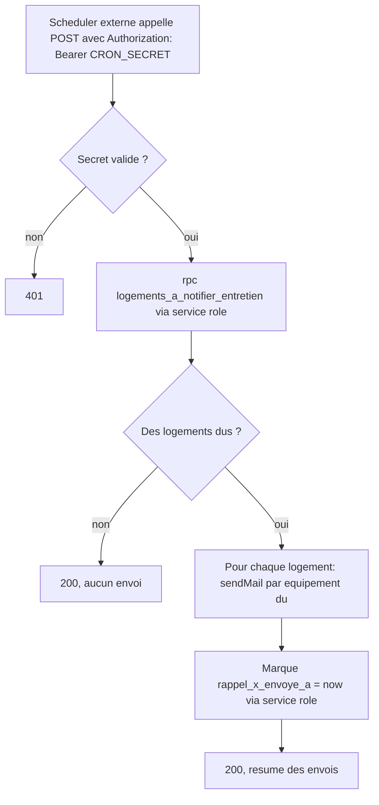

# Instruction: Calcul et envoi des rappels

## Architecture projection

> Tree of the final files. ✅ create · ✏️ modify · ❌ delete

```txt
.
└── apps/
    └── web/
        └── app/
            └── api/
                └── cron/
                    └── rappels-entretien/
                        └── route.ts   ✅ POST : vérifie le secret, envoie les rappels dus, marque l'envoi
```

## User Journey



## Tasks to do

### `1)` Créer la Route Handler de rappels

> Elle ne doit jamais être déclenchable par autre chose que le scheduler qui connaît le secret, et ne doit jamais notifier deux fois la même échéance.

1. Créer `apps/web/app/api/cron/rappels-entretien/route.ts` (`POST`). Comparer l'en-tête `Authorization: Bearer <valeur>` à `process.env.CRON_SECRET` ; toute absence ou différence retourne `401`.
2. `createServiceRoleSupabaseClient().rpc("logements_a_notifier_entretien")`.
3. Pour chaque ligne : si `chauffage_du`, envoyer un email (`sendMail`) au propriétaire mentionnant l'échéance chauffage/ramonage et le lien vers `/proprietaire/espace` ; si `vmc_du`, même chose pour la VMC (un email séparé par équipement dû, jamais combiné à tort). Après un envoi réussi, mettre à jour `rappel_chauffage_envoye_a`/`rappel_vmc_envoye_a` à `now()` via le client de service. Un échec d'envoi pour un logement n'empêche pas de traiter les suivants.
4. Retourner un résumé (`{ notifies: number }`).

## Test acceptance criteria

| Task | Acceptance criteria                                                                                                                                       |
| ---- | ------------------------------------------------------------------------------------------------------------------------------------------------------------ |
| 1    | Un appel sans le bon secret est refusé (`401`), sans effectuer de lecture. Un logement avec une échéance chauffage dans les 30 jours et pas encore notifié reçoit réellement un email (vérifié via une adresse réelle et Resend) et son `rappel_chauffage_envoye_a` est renseigné ; un second appel immédiat ne renvoie pas de second email pour cette même échéance. Un logement sans équipement concerné, ou avec une échéance lointaine, n'est jamais notifié. |
