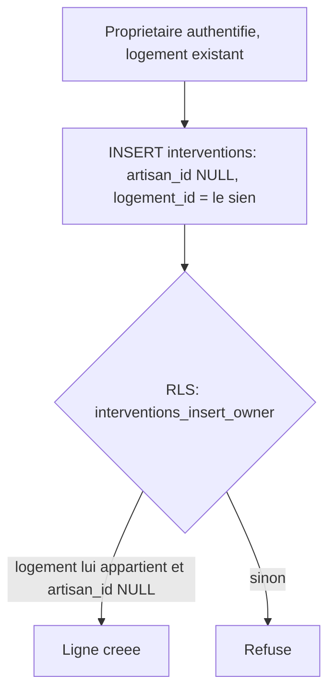

# Instruction: Schéma : interventions ouvertes au propriétaire

## Architecture projection

> Tree of the final files. ✅ create · ✏️ modify · ❌ delete

```txt
.
└── supabase/
    └── migrations/
        └── 0015_saisie_intervention_proprietaire.sql   ✅ colonnes nullables + policy insert propriétaire
```

## User Journey



## Tasks to do

### `1)` Ouvrir la table `interventions` à une saisie sans artisan

> Une intervention doit pouvoir exister sans artisan déclarant, tout en restant impossible à créer pour le logement de quelqu'un d'autre.

1. `alter table public.interventions alter column artisan_id drop not null;` — une saisie propriétaire n'a pas d'artisan.
2. `alter table public.interventions alter column facture_path drop not null;` — la facture est optionnelle dans ce flux (elle reste de fait toujours fournie côté artisan, contrôlé par la Route Handler artisan existante, pas par une contrainte SQL).
3. `alter table public.interventions alter column adresse_logement drop not null, alter column email_client drop not null;` — ces deux champs ne servent qu'à la résolution d'adresse du flux artisan (`match_or_create_logement`) ; un propriétaire connaît déjà son `logement_id`, aucune résolution n'est nécessaire.
4. Ajouter une contrainte `check` garantissant qu'une ligne trace toujours soit un artisan soit un logement : `add constraint interventions_artisan_or_logement check (artisan_id is not null or logement_id is not null);`
5. Créer la policy `interventions_insert_owner` (`for insert to authenticated`) : `with check (artisan_id is null and exists (select 1 from public.logements l where l.id = interventions.logement_id and l.proprietaire_id = auth.uid()))`.

## Test acceptance criteria

| Task | Acceptance criteria                                                                                                                                       |
| ---- | ------------------------------------------------------------------------------------------------------------------------------------------------------------ |
| 1    | Un propriétaire authentifié peut insérer directement (via le client Supabase, session réelle) une ligne `interventions` avec `artisan_id = null` et son propre `logement_id`. La même insertion avec le `logement_id` d'un autre propriétaire est refusée par RLS. Le flux artisan existant (US-02/US-03/US-04) continue de fonctionner sans régression : une soumission artisan complète (avec facture) reste acceptée. |
