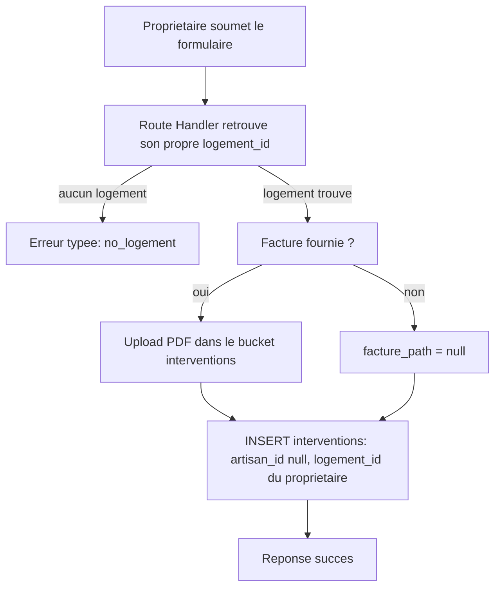

# Instruction: Route Handler de saisie propriétaire

## Architecture projection

> Tree of the final files. ✅ create · ✏️ modify · ❌ delete

```txt
.
└── apps/
    └── web/
        └── app/
            └── api/
                └── proprietaire/
                    └── interventions/
                        └── route.ts   ✅ POST : valide, upload facture optionnelle, insère
```

## User Journey



## Tasks to do

### `1)` Créer la Route Handler `POST /api/proprietaire/interventions`

> La saisie échoue proprement si le propriétaire n'a pas encore de fiche, et n'est jamais bloquée par l'absence de facture.

1. Vérifier la session (comme les autres routes propriétaire) ; retourner `unauthenticated` sinon.
2. `select id from logements where proprietaire_id = auth.uid()` (RLS déjà scopée) ; si absent, retourner une erreur typée `no_logement` (défense en profondeur — la page elle-même redirige déjà avant d'arriver ici, cf. phase 3).
3. Lire le `FormData` : `typeTravaux`, `dateIntervention`, `montantEuros`, `corpsMetier` (requis), `facture` (fichier PDF, optionnel). Rejeter en `invalid_request` si un champ requis manque, en `invalid_file_type` si une facture est fournie mais n'est pas un PDF.
4. Si une facture est fournie, l'uploader dans le bucket `interventions` existant (même chemin `<user.id>/facture-<uuid>.pdf` que le flux artisan) ; sinon `facture_path = null`.
5. Insérer dans `interventions` : `artisan_id: null`, `logement_id` (celui retrouvé à l'étape 2), `type_travaux`, `date_intervention`, `montant_euros`, `corps_metier`, `facture_path`, `rge_verifie: false`, `rge_verifie_a: null`, `artisan_siret: null`. Ne pas renseigner `adresse_logement`/`email_client` (désormais nullables).
6. En cas d'échec d'insertion après upload, supprimer le fichier facture uploadé (même garde que la route artisan).
7. Retourner `{ success: true }`.

## Test acceptance criteria

| Task | Acceptance criteria                                                                                                                                       |
| ---- | ------------------------------------------------------------------------------------------------------------------------------------------------------------ |
| 1    | Un propriétaire avec une fiche peut soumettre une intervention complète avec facture (PDF stocké) et sans facture (créée quand même, `facture_path` nul). Un propriétaire sans fiche reçoit `no_logement` sans qu'aucune ligne ne soit créée. Un champ requis manquant ou une facture non-PDF sont rejetés avec un message typé. |
