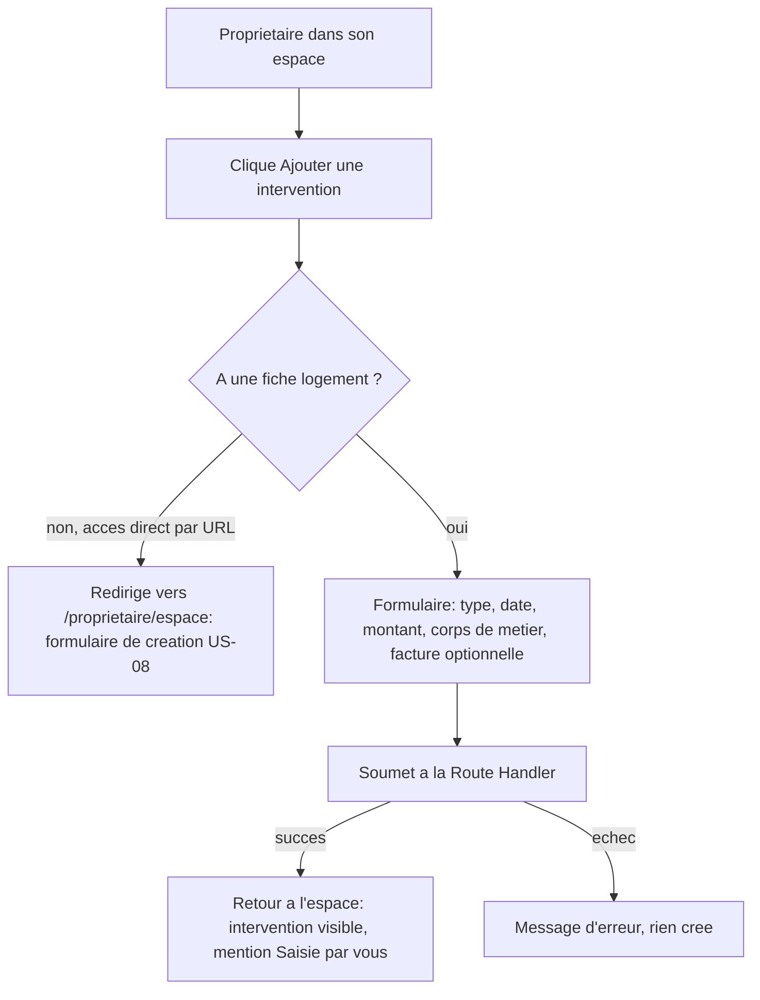

# Instruction: Écran de saisie et affichage de l'origine

## Architecture projection

> Tree of the final files. ✅ create · ✏️ modify · ❌ delete

```txt
.
└── apps/
    └── web/
        └── app/
            └── (owner)/
                └── proprietaire/
                    └── espace/
                        ├── page.tsx                            ✏️ lien "Ajouter une intervention" + mention d'origine dans l'historique
                        └── interventions/
                            └── nouvelle/
                                ├── page.tsx                     ✅ garde d'accès (fiche requise) + rendu du formulaire
                                └── InterventionProprietaireForm.tsx  ✅ formulaire de saisie (client)
```

## User Journey



## Wireframe

```txt
┌─────────────────────────────────────────────────┐
│ (1) ← Retour à mon espace                        │
│ (2) Ajouter une intervention                     │
├─────────────────────────────────────────────────┤
│ (3) Type de travaux        [______________]     │
│ (4) Date de l'intervention  [__/__/____]         │
│ (5) Montant (€)             [__________]         │
│ (6) Corps de métier          [▼ Sélectionner]    │
│ (7) Facture (PDF, optionnel) [Choisir un fichier]│
│ (8) [message d'erreur]                           │
│ (9) [ Enregistrer l'intervention ]               │
└─────────────────────────────────────────────────┘
```

1. Lien retour vers `/proprietaire/espace`.
2. Titre de la page.
3-6. Champs requis, mêmes composants (`Input`/`Select`) que le formulaire artisan.
7. Upload PDF, seul champ optionnel.
8. Message d'erreur affiché si la soumission échoue.
9. CTA de soumission.

## Tasks to do

### `1)` Garder l'accès à la saisie derrière une fiche logement

> Un propriétaire sans fiche ne doit jamais atterrir sur un formulaire de saisie qui échouera.

1. Créer `apps/web/app/(owner)/proprietaire/espace/interventions/nouvelle/page.tsx` (Server Component) : vérifie la session (redirige vers `/proprietaire/connexion` sinon), vérifie qu'un logement existe pour ce propriétaire (redirige vers `/proprietaire/espace` sinon), rend `InterventionProprietaireForm`.

### `2)` Construire le formulaire de saisie

> Le propriétaire saisit une intervention avec les mêmes garanties de validation que le flux artisan, sans jamais être bloqué par l'absence de facture.

1. Créer `InterventionProprietaireForm.tsx` (client) : champs `typeTravaux`, `dateIntervention`, `montantEuros`, `corpsMetier` (`Select` réutilisant `CORPS_METIER_OPTIONS`), `facture` (fichier, non requis). Soumet en `FormData` à `POST /api/proprietaire/interventions`, affiche l'erreur retournée, `router.push("/proprietaire/espace")` sur succès.

### `3)` Afficher l'origine et le point d'entrée dans l'espace propriétaire

> L'historique distingue clairement une intervention saisie par le propriétaire d'une intervention déclarée par un artisan.

1. Dans `apps/web/app/(owner)/proprietaire/espace/page.tsx`, ajouter un lien "Ajouter une intervention" vers `/proprietaire/espace/interventions/nouvelle`, visible uniquement quand `logement` existe (à côté du titre "Historique des interventions").
2. Étendre le `select` des interventions pour inclure `artisan_id`. Dans chaque ligne de la liste, si `artisan_id` est `null` : afficher "Saisie par vous" à la place de "Artisan (SIRET ...)", et omettre le badge RGE ainsi que la mention décennale (non applicables à une saisie propriétaire).

## Test acceptance criteria

| Task | Acceptance criteria                                                                                                                                       |
| ---- | ------------------------------------------------------------------------------------------------------------------------------------------------------------ |
| 1    | Naviguer directement vers `/proprietaire/espace/interventions/nouvelle` sans fiche logement redirige vers `/proprietaire/espace` où le formulaire de création (US-08) s'affiche. |
| 2    | Avec une fiche existante, soumettre le formulaire avec tous les champs requis (avec ou sans facture) crée l'intervention et ramène à l'espace propriétaire. |
| 3    | L'intervention saisie apparaît dans l'historique avec la mention "Saisie par vous", sans badge RGE ni mention décennale. Les interventions déclarées par un artisan restent affichées comme avant (SIRET, badge RGE, décennale). |
